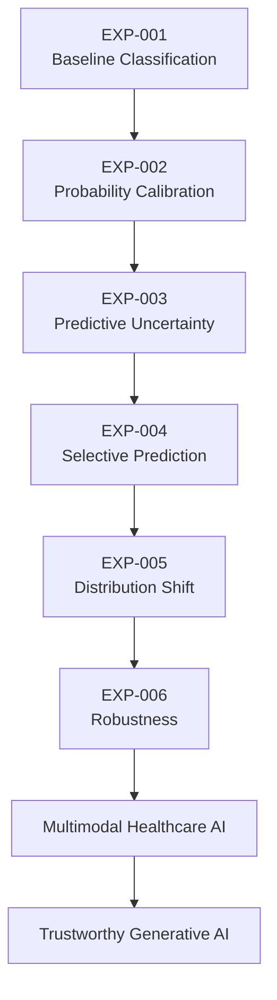
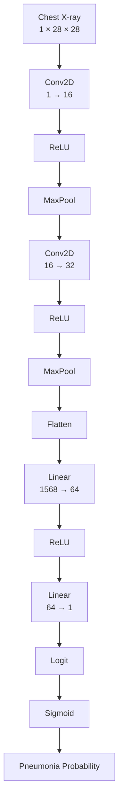
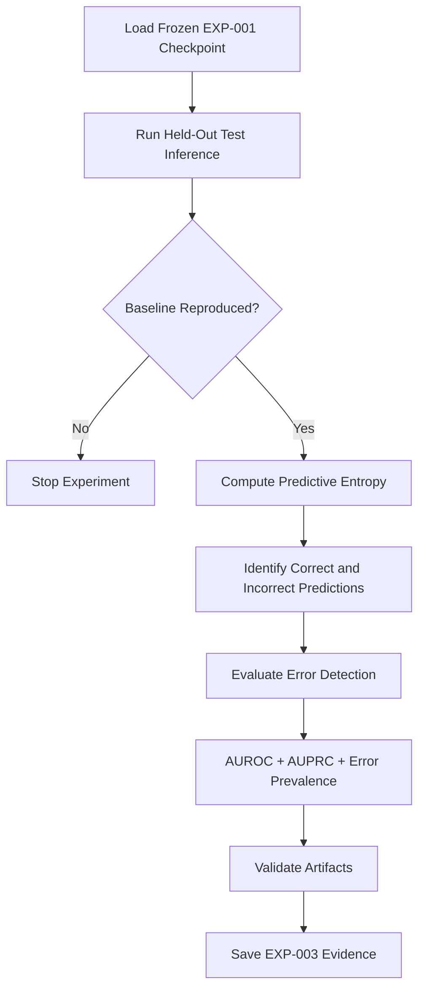
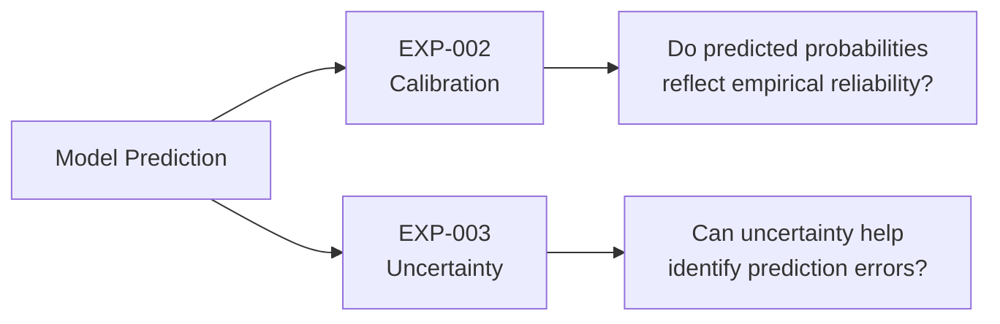
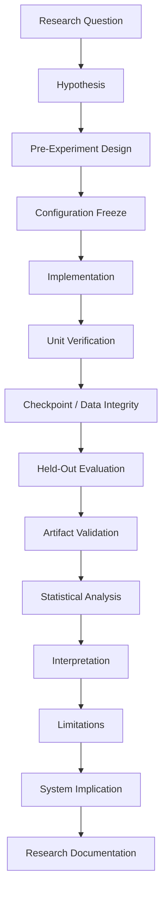
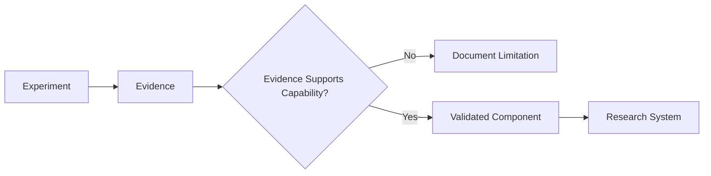
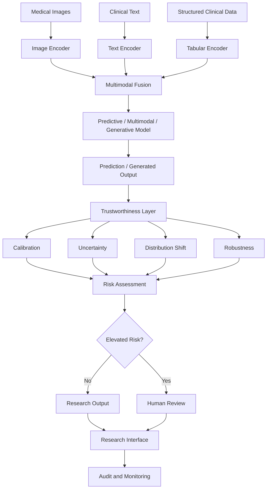

# Trustworthy Healthcare AI

> **Research portfolio investigating uncertainty, calibration, robustness, and multimodal machine learning for trustworthy healthcare AI.**

This repository contains an evolving research programme focused on a central question:

> **How can machine-learning systems for healthcare communicate and manage predictive uncertainty, particularly when their predictions may be wrong or when the data distribution changes?**

The work begins with controlled medical-image classification experiments and progressively develops toward uncertainty-aware, robust, multimodal, and generative healthcare AI.

The repository follows an **evidence-first research workflow**:


Results are documented only after experimental evidence has been generated and checked.

---

## Research Motivation

High predictive accuracy alone is insufficient for high-stakes machine-learning applications.

A healthcare AI model may:

- achieve strong aggregate performance;
- produce poorly calibrated probabilities;
- make highly confident incorrect predictions;
- fail to recognize uncertainty;
- degrade under distribution shift;
- remain confidently wrong when encountering unfamiliar data.

These behaviours motivate research beyond conventional predictive performance.

This project therefore investigates:

```text
Prediction performance
        ↓
Probability calibration
        ↓
Predictive uncertainty
        ↓
Selective prediction
        ↓
Distribution shift
        ↓
Robustness
        ↓
Multimodal healthcare AI
        ↓
Trustworthy generative AI
```

The long-term objective is not merely to build a model that predicts.

It is to investigate how a healthcare AI system can provide evidence about **when its outputs may be unreliable**.

---

# Current Research Question

The current research stage focuses on uncertainty quantification.

### EXP-003 Research Question

> **Does predictive uncertainty provide useful information for distinguishing incorrect from correct predictions produced by the baseline medical-image classifier?**

The first uncertainty baseline uses deterministic binary predictive entropy and evaluates uncertainty as an **error-detection signal**.

EXP-003 is implemented, but its experimental evaluation has not yet been completed.

No EXP-003 result is claimed in this README.

---

# Research Progress

| Experiment | Research Question | Status |
|---|---|---|
| **EXP-001** | How effectively can a baseline CNN distinguish pneumonia-positive from pneumonia-negative chest X-ray images? | ✅ Complete |
| **EXP-002** | How well calibrated are the baseline model's probability estimates? | ✅ Complete |
| **EXP-003** | Can predictive uncertainty distinguish incorrect from correct predictions? | 🧪 Implementation complete — evaluation pending |
| **EXP-004** | Can uncertainty support selective prediction or referral? | 📋 Planned |
| **EXP-005** | How does the model behave under distribution shift? | 📋 Planned |
| **EXP-006** | How robust are predictions and uncertainty under perturbation? | 📋 Planned |
| **Future** | How can trustworthy mechanisms extend to multimodal and generative healthcare AI? | 🔭 Research direction |

---

# Experimental Progression



Each experiment is intended to answer a specific research question and provide evidence for—or against—the next system capability.

---

# EXP-001 — Baseline Medical Image Classification

**Status:** Complete

EXP-001 established the predictive baseline used by subsequent experiments.

### Dataset

**PneumoniaMNIST — MedMNIST v2**

Binary chest X-ray classification:

- `0` — Normal
- `1` — Pneumonia

Dataset split:

| Split | Samples |
|---|---:|
| Training | 4,708 |
| Validation | 524 |
| Test | 624 |
| **Total** | **5,856** |

The training distribution was imbalanced:

- Normal: 1,214
- Pneumonia: 3,494
- Pneumonia proportion: 74.21%

No class resampling was applied during the baseline experiment.

---

## Baseline Architecture



Training configuration:

- Loss: `BCEWithLogitsLoss`
- Optimizer: Adam
- Learning rate: `0.001`
- Epochs: `10`
- Random seed: `42`

---

## EXP-001 Results

Held-out test performance:

| Metric | Result |
|---|---:|
| Accuracy | **0.884615** |
| AUROC | **0.936993** |
| Sensitivity | **0.9846** |
| Specificity | **0.7179** |
| Precision | **0.8533** |
| F1-score | **0.914286** |

Confusion matrix:

| | Predicted Normal | Predicted Pneumonia |
|---|---:|---:|
| **Actual Normal** | 168 | 66 |
| **Actual Pneumonia** | 6 | 384 |

The model substantially exceeded the majority-class accuracy baseline of approximately **74.21%**.

However, aggregate predictive performance exposed only part of the model's behaviour.

---

## Critical EXP-001 Observation

An incorrect normal case received approximately:

> **99.98% predicted probability of pneumonia**

This is an important research observation.

The model was not merely wrong.

It was **highly confident while wrong**.

That motivates the transition from:

```text
Can the model predict?
```

to:

```text
Can the model recognize when its prediction may be unreliable?
```

This observation became one of the motivations for EXP-002 and EXP-003.

Detailed evidence:

**[`docs/EXP_001_BASELINE.md`](docs/EXP_001_BASELINE.md)**

---

# EXP-002 — Probability Calibration

**Status:** Complete

Strong classification performance does not guarantee that predicted probabilities accurately represent empirical reliability.

EXP-002 therefore investigated the calibration behaviour of the frozen EXP-001 classifier.

The experiment evaluated:

- reliability behaviour;
- Expected Calibration Error;
- Brier score;
- confidence behaviour;
- high-confidence errors;
- temperature scaling.

---

## Temperature Scaling

Temperature scaling transforms logits using:

\[
p = \sigma\left(\frac{z}{T}\right)
\]

where:

- \(z\) is the original logit;
- \(T\) is a learned positive temperature;
- \(\sigma\) is the sigmoid function.

The temperature was fitted using validation data rather than the held-out test set.

The corrected fitted temperature was:

```text
T = 1.007948
```

Validation negative log-likelihood changed from:

```text
Before: 0.097432
After:  0.097427
```

The improvement was negligible in this experimental setting.

This does **not** imply that temperature scaling is generally ineffective in medical AI.

It indicates that global temperature scaling provided little validation NLL improvement for this specific model, dataset, and experimental configuration.

Detailed evidence:

**[`docs/EXP_002_CALIBRATION.md`](docs/EXP_002_CALIBRATION.md)**

---

# EXP-003 — Predictive Uncertainty

**Status:** Implementation complete — experimental evaluation pending

EXP-003 moves from population-level probability calibration toward prediction-level uncertainty.

The central question is:

> **Can uncertainty help distinguish predictions that are wrong from predictions that are correct?**

---

## Deterministic Uncertainty Baseline

The first method is binary predictive entropy:

\[
H(p) = -p\log(p) - (1-p)\log(1-p)
\]

For binary classification:

```text
p ≈ 0.50
    ↓
High predictive entropy
    ↓
High ambiguity
```

while:

```text
p ≈ 0 or p ≈ 1
    ↓
Low predictive entropy
    ↓
High model confidence
```

This creates an important potential failure case:

```text
Incorrect prediction
        +
Extreme probability
        ↓
Low entropy
        ↓
Confidently wrong
```

EXP-003 is designed to measure this behaviour rather than assume entropy is a reliable uncertainty signal.

---

## Error Detection

Prediction error is treated as the positive class:

```text
Correct prediction   → error = 0
Incorrect prediction → error = 1
```

Predictive entropy is then evaluated as the error-detection score.

Primary evaluation metrics:

- error-detection AUROC;
- error-detection AUPRC;
- error prevalence.

Supporting analysis includes:

- uncertainty distributions for correct predictions;
- uncertainty distributions for incorrect predictions;
- descriptive statistics;
- high-confidence errors;
- low-entropy errors.

---

## EXP-003 Integrity Gate

Before EXP-003 evidence can be saved, the experiment runner checks whether the frozen EXP-001 baseline is reproduced.

Expected baseline:

```text
Test samples: 624
Accuracy:     0.884615

TN = 168
FP = 66
FN = 6
TP = 384
```

Experimental flow:



This protects the experiment from silently evaluating uncertainty on a different model, preprocessing pipeline, or prediction configuration.

---

## EXP-003 Current State

| Component | Status |
|---|---|
| Research question | ✅ Defined |
| Experimental design | ✅ Frozen |
| Experimental configuration | ✅ Frozen |
| Entropy implementation | ✅ Implemented |
| Entropy tests | ✅ Written |
| Error-detection evaluation | ✅ Implemented |
| Evaluation tests | ✅ Written |
| Experiment runner | ✅ Implemented |
| Baseline integrity gate | ✅ Implemented |
| Test execution | ⏳ Pending validation |
| Baseline reproduction | ⏳ Pending validation |
| Held-out experiment execution | ⏳ Pending |
| Experimental evidence | ⏳ Pending |
| Scientific interpretation | ⏳ Pending |

No EXP-003 experimental performance is reported until these validation and execution stages are complete.

### EXP-003 Documentation

- **[Experimental Design](experiments/EXP_003_DESIGN.md)**
- **[Frozen Configuration](experiments/EXP_003_CONFIG.md)**
- **[Experiment Runner](experiments/experiment_003_uncertainty.py)**

---

# From Calibration to Uncertainty

Calibration and uncertainty address related but different questions.



A model may be reasonably calibrated at the population level while still producing dangerous high-confidence errors for individual samples.

The two analyses should therefore not be treated as interchangeable.

---

# Research Methodology

The repository follows a controlled experimental process.



This separates:

1. what was planned;
2. what was implemented;
3. what was observed;
4. what can reasonably be concluded.

Detailed methodology:

**[`docs/METHODOLOGY.md`](docs/METHODOLOGY.md)**

---

# Evidence-Driven System Development

The research programme is also being used to develop reusable trustworthy-AI capabilities.



Examples:

| Experiment | Candidate System Capability |
|---|---|
| EXP-001 | Prediction engine |
| EXP-002 | Calibration evaluation |
| EXP-003 | Uncertainty engine |
| EXP-004 | Selective prediction / referral |
| EXP-005 | Distribution-shift evaluation |
| EXP-006 | Robustness evaluation |

A component is not considered validated merely because it has been implemented.

Its system role must be supported by experimental evidence.

---

# Target Research Architecture

The longer-term research direction extends beyond binary medical-image classification.

The target architecture is:



### Important

This diagram represents the **target research architecture**.

It does **not** imply that multimodal fusion, generative modelling, clinical interfaces, or monitoring are currently implemented.

The present experimental system is substantially narrower:

```text
PneumoniaMNIST image
        ↓
Baseline CNN
        ↓
Logit
        ↓
Probability
        ↓
Prediction evaluation
        ↓
Calibration analysis
        ↓
Predictive uncertainty evaluation
```

The architecture will expand only as the corresponding research components are implemented and evaluated.

---

# Current vs Target Capability

| Capability | Current State |
|---|---|
| Medical-image input | ✅ Implemented |
| Binary classification | ✅ Implemented |
| Predictive evaluation | ✅ Implemented |
| Probability calibration analysis | ✅ Implemented |
| Temperature scaling | ✅ Evaluated |
| Deterministic predictive entropy | 🧪 Implemented; evaluation pending |
| Error-detection evaluation | 🧪 Implemented; evaluation pending |
| Selective prediction | 📋 Planned |
| Distribution-shift evaluation | 📋 Planned |
| Robustness evaluation | 📋 Planned |
| Multimodal input | 🔭 Future research |
| Vision-language modelling | 🔭 Future research |
| Generative healthcare AI | 🔭 Future research |
| Research interface | 🔭 Future research |
| Audit / monitoring layer | 🔭 Future research |

---

# Repository Structure

```text
trustworthy-healthcare-ai/
│
├── README.md
├── pyproject.toml
├── uv.lock
├── .python-version
│
├── src/
│   ├── __init__.py
│   │
│   ├── data/
│   │   └── __init__.py
│   │
│   ├── models/
│   │   └── __init__.py
│   │
│   ├── evaluation/
│   │   ├── __init__.py
│   │   └── uncertainty_metrics.py
│   │
│   └── uncertainty/
│       ├── __init__.py
│       └── entropy.py
│
├── notebooks/
│   ├── 01_baseline_medical_imaging.ipynb
│   └── 02_confidence_calibration.ipynb
│
├── experiments/
│   ├── EXP_003_DESIGN.md
│   ├── EXP_003_CONFIG.md
│   └── experiment_003_uncertainty.py
│
├── results/
│   ├── figures/
│   ├── models/
│   │   └── experiment_001_baseline_cnn.pt
│   └── tables/
│
├── tests/
│   ├── test_entropy.py
│   └── test_uncertainty_metrics.py
│
└── docs/
    ├── EVALUATION.md
    ├── EXPERIMENTS.md
    ├── EXP_001_BASELINE.md
    ├── EXP_002_CALIBRATION.md
    ├── METHODOLOGY.md
    ├── PUBLICATION_PLAN.md
    ├── REPRODUCIBILITY.md
    ├── RESEARCH_LOG.md
    ├── RESEARCH_PLAN.md
    └── SYSTEM_ARCHITECTURE.md
```

---

# Documentation Map

The repository separates executive-level navigation from detailed research documentation.

| Document | Purpose |
|---|---|
| **[Research Plan](docs/RESEARCH_PLAN.md)** | Research direction, questions, and progression |
| **[Experiments Registry](docs/EXPERIMENTS.md)** | Canonical experiment status and evidence index |
| **[Methodology](docs/METHODOLOGY.md)** | Experimental methodology and research controls |
| **[Evaluation](docs/EVALUATION.md)** | Evaluation principles and metrics |
| **[Reproducibility](docs/REPRODUCIBILITY.md)** | Reproduction and experimental integrity |
| **[System Architecture](docs/SYSTEM_ARCHITECTURE.md)** | Evidence-driven system architecture |
| **[Publication Plan](docs/PUBLICATION_PLAN.md)** | Research publication strategy |
| **[Research Log](docs/RESEARCH_LOG.md)** | Chronological research record |
| **[EXP-001 Report](docs/EXP_001_BASELINE.md)** | Baseline classification experiment |
| **[EXP-002 Report](docs/EXP_002_CALIBRATION.md)** | Calibration experiment |
| **[EXP-003 Design](experiments/EXP_003_DESIGN.md)** | Frozen uncertainty experiment design |
| **[EXP-003 Configuration](experiments/EXP_003_CONFIG.md)** | Frozen execution configuration |

---

# Reproducibility

The project uses:

- Python 3.11;
- `uv` for dependency management;
- `pyproject.toml`;
- `uv.lock`;
- fixed random seeds where applicable;
- frozen model checkpoints;
- explicit dataset splits;
- held-out test evaluation;
- experiment-specific artifacts;
- unit verification for reusable research functions.

Environment reconstruction:

```bash
uv sync
```

Detailed reproducibility protocol:

**[`docs/REPRODUCIBILITY.md`](docs/REPRODUCIBILITY.md)**

---

# Research Integrity Principles

The project follows several rules intended to reduce avoidable experimental bias.

### 1. Test data are not training data

The held-out test set is reserved for final evaluation.

### 2. Experimental decisions should precede test inspection

Methods, thresholds, and experimental conditions should be defined before interpreting held-out results whenever feasible.

### 3. Negative findings remain findings

A method is not considered successful merely because it was implemented.

Weak or negative results may provide evidence about limitations and motivate subsequent experiments.

### 4. Results are not written in advance

Documentation distinguishes planned methodology from observed evidence.

### 5. Claims remain proportional to evidence

The repository does not claim clinical validation, regulatory readiness, diagnostic safety, or production clinical deployment.

This is a **research system and experimental portfolio**.

---

# Technology Stack

Current core technologies include:

- Python
- PyTorch
- TorchVision
- MedMNIST
- NumPy
- pandas
- scikit-learn
- Matplotlib
- Jupyter
- `uv`
- Git
- GitHub

The technology stack will expand only when required by subsequent research stages.

---

# Research Direction

The project is progressing toward research in:

- uncertainty-aware AI;
- trustworthy machine learning;
- medical image analysis;
- robustness under distribution shift;
- multimodal healthcare AI;
- vision-language models;
- generative AI for healthcare;
- evaluation of AI reliability in high-stakes settings.

The intended progression is:


---

# Publication Direction

The current experimental programme is intended to support a research manuscript around the broader question of whether predictive performance alone adequately characterizes reliability in medical-image classification.

A working direction is:

> **Beyond Accuracy: Evaluating Uncertainty and Robustness in Deep Learning for Medical Image Classification Under Distribution Shift**

The final manuscript scope and conclusions will depend on the completed experimental evidence.

Publication planning:

**[`docs/PUBLICATION_PLAN.md`](docs/PUBLICATION_PLAN.md)**

---

# Current Research Position

The project has moved through:

```text
Repository foundation
        ↓
Medical-image baseline
        ↓
Calibration evaluation
        ↓
Uncertainty methodology
        ↓
EXP-003 implementation
```

The current experimental boundary is:

```text
EXP-003 implementation
        ↓
Verification
        ↓
Baseline integrity confirmation
        ↓
Held-out execution
        ↓
Experimental evidence
        ↓
Scientific interpretation
```

EXP-003 should not be marked complete until those evidence stages have been completed.

---

# Scope and Limitations

Current limitations include:

- a single medical-image benchmark;
- binary classification;
- low-resolution benchmark images;
- a relatively small CNN;
- no external clinical validation;
- no current multimodal implementation;
- no current generative-model implementation;
- no current distribution-shift experiment;
- no current robustness experiment;
- no clinical deployment.

These limitations are intentional boundaries of the current research stage rather than claims about the final research direction.

---

# Repository Principle

The central principle of this repository is:

> **Implementation demonstrates that something can be built. Evidence determines what can be claimed.**

The project therefore progresses through controlled experiments rather than adding capabilities solely for demonstration.

```text
Research Question
        ↓
Experiment
        ↓
Evidence
        ↓
Interpretation
        ↓
Validated Capability
        ↓
Integrated Research System
```

---

## Author

**Hammed Fatai**

Research interests:

**Artificial Intelligence · Machine Learning · Trustworthy AI · Healthcare AI · Uncertainty Quantification · Multimodal AI · Generative AI**

GitHub: **[@hammedfataio](https://github.com/hammedfataio)**

---

## Project Status

**Active Research**

Current stage:

> **EXP-003 — Predictive Uncertainty: implementation complete; experimental evaluation pending.**

The next repository update to EXP-003 results should occur only after verification, baseline integrity confirmation, experimental execution, and evidence inspection.
