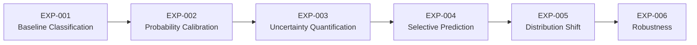
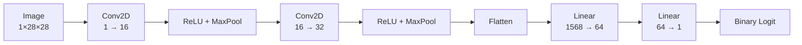
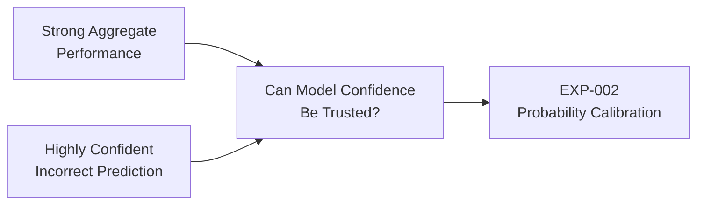
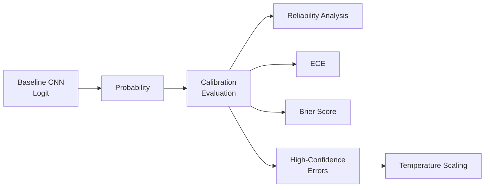
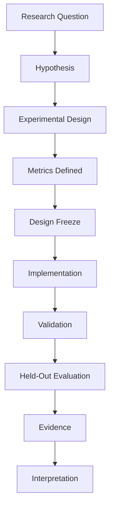
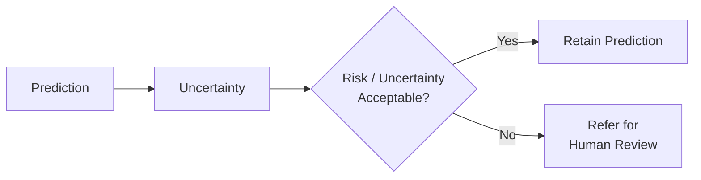
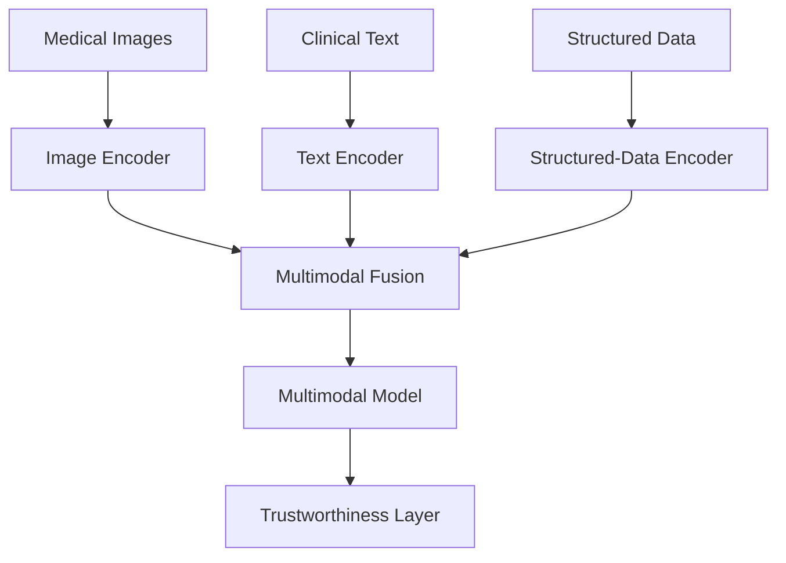
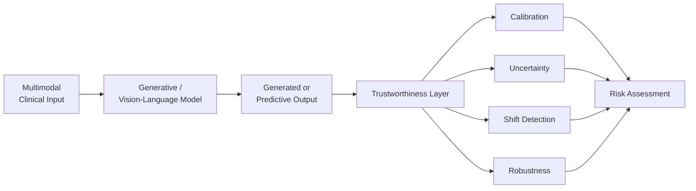
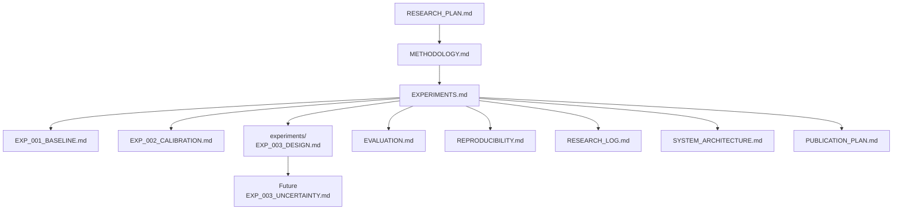

# Experiment Registry

**Project:** Trustworthy Healthcare AI  
**Purpose:** Master record of experimental progression, verified evidence, and research status  
**Status:** Active Research Programme  

---

## 1. Purpose

This document provides the master registry for experiments conducted within the Trustworthy Healthcare AI research programme.

It is designed to answer four questions:

1. What experiment was conducted?
2. What research question did it investigate?
3. What evidence was produced?
4. What research question follows from the evidence?

Detailed scientific reports are maintained separately for each completed experiment.

---

## 2. Research Progression



The programme follows an evidence-driven progression:

```text
Prediction
    ↓
Calibration
    ↓
Uncertainty
    ↓
Selective Prediction
    ↓
Distribution Shift
    ↓
Robustness
    ↓
Multimodal Trustworthy AI
```

---

# 3. Experiment Status

| Experiment | Research Focus | Status |
|---|---|---|
| EXP-001 | Baseline medical-image classification | Complete |
| EXP-002 | Probability calibration | Complete |
| EXP-003 | Uncertainty quantification and error detection | Design frozen — implementation next |
| EXP-004 | Selective prediction and referral | Planned |
| EXP-005 | Distribution-shift evaluation | Planned |
| EXP-006 | Robustness evaluation | Planned |
| Future | Multimodal healthcare AI | Future research |
| Future | Trustworthy generative/VLM healthcare AI | Future research |
| Future | Integrated research prototype | Future research |

---

# 4. EXP-001 — Baseline Medical Image Classification

**Status:** Complete  
**Dataset:** PneumoniaMNIST  
**Research Stage:** Predictive Baseline  

Detailed report:

```text
docs/EXP_001_BASELINE.md
```

Primary notebook:

```text
notebooks/01_baseline_medical_imaging.ipynb
```

Model checkpoint:

```text
results/models/experiment_001_baseline_cnn.pt
```

Metrics artifact:

```text
results/tables/experiment_001_baseline_metrics.csv
```

---

## 4.1 Research Question

> How effectively can a baseline convolutional neural network distinguish pneumonia-positive from pneumonia-negative chest X-ray images using the PneumoniaMNIST benchmark?

---

## 4.2 Dataset

PneumoniaMNIST is used as the initial medical-imaging benchmark.

The task is binary classification:

| Label | Class |
|---:|---|
| 0 | Normal |
| 1 | Pneumonia |

Dataset splits:

| Split | Samples |
|---|---:|
| Training | 4,708 |
| Validation | 524 |
| Test | 624 |
| **Total** | **5,856** |

Training-set class distribution:

| Class | Samples | Percentage |
|---|---:|---:|
| Normal | 1,214 | 25.79% |
| Pneumonia | 3,494 | 74.21% |

The majority-class proportion is approximately 74.21%.

No resampling strategy was introduced for the baseline experiment.

---

## 4.3 Baseline Model

The experiment uses a compact convolutional neural network.



Training configuration:

| Component | Configuration |
|---|---|
| Random seed | 42 |
| Batch size | 64 |
| Loss | BCEWithLogitsLoss |
| Optimiser | Adam |
| Learning rate | 0.001 |
| Epochs | 10 |

---

## 4.4 Verified Held-Out Test Results

The verified EXP-001 test results are:

| Metric | Result |
|---|---:|
| Accuracy | **0.884615** |
| AUROC | **0.936993** |
| Sensitivity | **0.9846** |
| Specificity | **0.7179** |
| Precision | **0.8533** |
| F1-score | **0.914286** |

Confusion matrix:

| | Predicted Normal | Predicted Pneumonia |
|---|---:|---:|
| **Actual Normal** | TN = 168 | FP = 66 |
| **Actual Pneumonia** | FN = 6 | TP = 384 |

---

## 4.5 Important Failure Observation

Prediction-level analysis identified an incorrectly classified normal image for which the model produced approximately:

```text
P(pneumonia) ≈ 0.9998
```

Therefore:



This observation provides the empirical motivation for EXP-002.

---

## 4.6 EXP-001 Conclusion

EXP-001 establishes that the baseline CNN provides useful benchmark predictive performance.

However, the presence of a highly confident incorrect prediction demonstrates that:

> Strong aggregate predictive performance does not establish reliable prediction-level confidence.

This motivates explicit investigation of probability calibration.

---

# 5. EXP-002 — Probability Calibration

**Status:** Complete  
**Research Stage:** Confidence Reliability  
**Predecessor:** EXP-001  
**Successor:** EXP-003  

Detailed report:

```text
docs/EXP_002_CALIBRATION.md
```

Primary notebook:

```text
notebooks/02_confidence_calibration.ipynb
```

---

## 5.1 Research Question

> How well calibrated are the probability estimates produced by a baseline CNN for pneumonia classification, and does the model exhibit overconfidence when making incorrect predictions?

---

## 5.2 Motivation

EXP-001 identified a highly confident incorrect prediction.

The model predicted pneumonia for a normal example with approximately:

```text
P(pneumonia) ≈ 0.9998
```

This raised a question that discrimination metrics alone cannot answer:

> Does predicted confidence correspond meaningfully to empirical correctness?

---

## 5.3 Calibration Framework

EXP-002 investigates probability reliability using:

- reliability analysis;
- Expected Calibration Error;
- Brier Score;
- confidence distributions;
- high-confidence error analysis; and
- temperature scaling.

Conceptually:



---

## 5.4 Temperature Scaling

Temperature scaling transforms the model logit using:

\[
z' = \frac{z}{T}
\]

where:

- \(z\) is the original logit;
- \(T\) is the learned positive temperature.

The corrected experiment fitted temperature using the validation data.

The verified learned temperature is:

```text
T = 1.007948
```

---

## 5.5 Verified Validation Result

The verified validation negative log-likelihood result is:

| Metric | Before Scaling | After Scaling |
|---|---:|---:|
| Validation NLL | **0.097432** | **0.097427** |

The observed change is extremely small.

Therefore, within this experimental configuration:

> Temperature scaling produced negligible improvement in validation negative log-likelihood.

---

## 5.6 Evidence Integrity Note

Earlier exploratory execution produced preliminary post-scaling test values under a different temperature result.

Those preliminary values are **not treated as the final corrected EXP-002 evidence**.

The canonical verified corrected evidence currently retained in this registry is:

```text
Temperature:
T = 1.007948

Validation NLL before:
0.097432

Validation NLL after:
0.097427
```

Exact corrected post-scaling test metrics should only be added if they are confirmed from the final saved corrected experimental artifact.

This prevents preliminary exploratory results from being presented as final evidence.

---

## 5.7 Interpretation

The result does not demonstrate that temperature scaling is generally ineffective.

It demonstrates only that:

> Under the evaluated model, dataset, validation split, and temperature-scaling configuration, the fitted global temperature was close to 1 and validation NLL changed negligibly.

This distinction is important.

The experiment does not support broad claims about calibration methods in medical AI.

---

## 5.8 Scientific Consequence

EXP-002 reveals an important distinction:

```text
Calibration
    ≠
Uncertainty Quantification
```

Calibration primarily investigates whether predicted probabilities are reliable at the population level.

It does not necessarily determine whether uncertainty is useful for identifying individual prediction errors.

Therefore the next question becomes:

> Can prediction-level uncertainty help distinguish incorrect predictions from correct predictions?

This motivates EXP-003.

---

# 6. EXP-003 — Uncertainty Quantification and Error Detection

**Status:** Design frozen — implementation next  
**Research Stage:** Prediction-Level Uncertainty  
**Predecessor:** EXP-002  

Pre-experiment protocol:

```text
experiments/EXP_003_DESIGN.md
```

Future completed report:

```text
docs/EXP_003_UNCERTAINTY.md
```

No EXP-003 result is recorded in this document yet.

---

## 6.1 Primary Research Question

> Does predictive uncertainty provide useful information for distinguishing incorrect from correct predictions produced by the baseline medical-image classifier?

---

## 6.2 Research Motivation

EXP-001 demonstrated that a model can be highly confident while wrong.

EXP-002 demonstrated that global temperature scaling produced negligible improvement in validation NLL under the evaluated configuration.

EXP-003 therefore moves from:

```text
Are probabilities calibrated?
```

to:

```text
Can uncertainty identify risky predictions?
```

---

## 6.3 Stage A — Deterministic Predictive Entropy

The initial uncertainty baseline will use binary predictive entropy:

\[
H(p) =
-p\log(p)
-(1-p)\log(1-p)
\]

where \(p\) represents the predicted probability of pneumonia.

Maximum binary entropy occurs around:

```text
p = 0.5
```

while probabilities near:

```text
0 or 1
```

produce lower predictive entropy.

---

## 6.4 Important Interpretation Boundary

Deterministic predictive entropy is a probability-derived uncertainty measure.

It should **not** be interpreted as complete epistemic uncertainty.

A model that is confidently wrong can produce:

```text
Very high confidence
       +
Very low entropy
       +
Incorrect prediction
```

Therefore failure of deterministic entropy to identify such errors would itself be scientifically informative.

---

## 6.5 Error-Detection Evaluation

For EXP-003:

```text
Correct prediction   → error target = 0
Incorrect prediction → error target = 1
```

Predictive uncertainty becomes the score used to discriminate between these outcomes.

Primary metrics:

- error-detection AUROC;
- error-detection AUPRC; and
- error prevalence.

Supporting analyses will examine:

- uncertainty distributions;
- correct versus incorrect predictions;
- high-confidence errors;
- low-uncertainty errors; and
- relevant uncertainty quantiles.

---

## 6.6 Experimental Governance

EXP-003 follows the principle:



The test set must not be used to choose methods, thresholds, or hyperparameters.

---

## 6.7 EXP-003 Evidence Status

At the current stage:

```text
Research question          COMPLETE
Hypotheses                 COMPLETE
Experimental protocol      COMPLETE
Metrics                    DEFINED
Design                     FROZEN

Implementation             NEXT
Execution                  NOT YET COMPLETED
Results                    NOT YET AVAILABLE
Interpretation             NOT YET AVAILABLE
```

No numerical EXP-003 results should be added until the experiment has actually been executed and validated.

---

# 7. EXP-004 — Selective Prediction and Referral

**Status:** Planned

EXP-004 is intended to investigate whether uncertainty information can support selective prediction.

Conceptually:



The experiment is expected to investigate risk-coverage behaviour and referral strategies.

Thresholds must be selected using validation evidence rather than test-set optimisation.

No EXP-004 results currently exist.

---

# 8. EXP-005 — Distribution Shift

**Status:** Planned

EXP-005 is intended to investigate model behaviour when the evaluation distribution differs from the original experimental conditions.

The central questions will include:

```text
Does predictive performance degrade under shift?

Does uncertainty increase under shift?

Can uncertainty help identify shifted or risky examples?
```

No EXP-005 results currently exist.

---

# 9. EXP-006 — Robustness

**Status:** Planned

EXP-006 is intended to investigate model sensitivity to controlled perturbations or other robustness challenges.

Conceptually:

```text
Original Input
      ↓
Controlled Perturbation
      ↓
Model
      ↓
Prediction + Uncertainty
      ↓
Robustness Evaluation
```

No EXP-006 results currently exist.

---

# 10. Future Multimodal Research

After the initial trustworthiness experiments, the research programme is intended to expand beyond image-only prediction.

Potential modalities include:

```text
Medical Images
Clinical Text
Structured Clinical Data
Laboratory Measurements
```

Conceptually:



These capabilities remain future research and should not be described as currently implemented.

---

# 11. Future Trustworthy Generative AI

A later research stage may investigate generative or vision-language models for healthcare.

Potential outputs could include:

- multimodal reasoning;
- clinical-text generation;
- image-text interpretation;
- structured prediction; and
- uncertainty-aware model outputs.

The trustworthiness framework would remain central:



This remains a target research direction rather than a completed capability.

---

# 12. System Capability Progression

Each experiment is intended to justify a research-system capability.

| Experiment | Scientific Question | Potential System Contribution |
|---|---|---|
| EXP-001 | Can the model predict? | Prediction engine |
| EXP-002 | Are probabilities reliable? | Calibration evaluation/layer |
| EXP-003 | Can uncertainty identify errors? | Candidate uncertainty engine |
| EXP-004 | Can risky cases be referred? | Selective prediction/referral |
| EXP-005 | What happens under shift? | Shift evaluation |
| EXP-006 | How stable is the model? | Robustness evaluation |
| Future | Can modalities be combined? | Multimodal modelling |
| Future | Can generation be made trustworthy? | Trustworthy generative/VLM capability |

A planned component becomes a validated system capability only when supported by experimental evidence.

---

# 13. Evidence-Driven Research Principle

The project follows:


This prevents the architecture from being defined solely by desired features.

The experimental evidence determines what can legitimately be incorporated into the research system.

---

# 14. Evidence Classification

Research outputs are classified as:

### Verified

Produced and confirmed by completed experimental execution.

### Preliminary

Generated during exploratory development but not treated as canonical evidence.

### Planned

Specified before execution.

### Future

Part of the broader research direction but not yet designed or implemented.

Only verified results should be presented as final experimental findings.

---

# 15. Current Verified Evidence

At the present research stage, the canonical verified evidence consists of:

### EXP-001

```text
Accuracy     = 0.884615
AUROC        = 0.936993
Sensitivity  = 0.9846
Specificity  = 0.7179
Precision    = 0.8533
F1-score     = 0.914286

TN = 168
FP = 66
FN = 6
TP = 384
```

Important prediction-level observation:

```text
Incorrect normal example:
P(pneumonia) ≈ 0.9998
```

### EXP-002

```text
Learned temperature:
T = 1.007948

Validation NLL:
Before = 0.097432
After  = 0.097427
```

Interpretation:

```text
Negligible validation-NLL improvement
under the evaluated temperature-scaling
configuration.
```

### EXP-003

```text
No experimental results yet.
Design frozen.
Implementation next.
```

---

# 16. Current Research Position

The project has progressed from:

```text
Can the model predict?
```

to:

```text
Can model confidence be trusted?
```

and now to:

```text
Can uncertainty help identify when
the model may be wrong?
```

This progression marks the transition from conventional predictive modelling toward explicit trustworthy-AI evaluation.

---

# 17. Research Integrity Rules

The experiment registry follows these rules:

1. No result is reported before execution.
2. Preliminary values are not silently promoted to final evidence.
3. Corrected experiments supersede exploratory runs.
4. Test data is not used for arbitrary method selection.
5. Negative findings are retained when scientifically informative.
6. Limitations are documented alongside positive findings.
7. Planned architecture is distinguished from implemented capability.
8. Benchmark performance is not presented as clinical validation.
9. Experiment reports must remain traceable to notebooks and saved artifacts.
10. README claims must remain consistent with verified evidence.

---

# 18. Documentation Relationships



---

# 19. Current Artifact Map

```text
trustworthy-healthcare-ai/
│
├── docs/
│   ├── EXPERIMENTS.md
│   ├── EXP_001_BASELINE.md
│   ├── EXP_002_CALIBRATION.md
│   ├── EVALUATION.md
│   ├── METHODOLOGY.md
│   ├── PUBLICATION_PLAN.md
│   ├── REPRODUCIBILITY.md
│   ├── RESEARCH_LOG.md
│   ├── RESEARCH_PLAN.md
│   └── SYSTEM_ARCHITECTURE.md
│
├── experiments/
│   └── EXP_003_DESIGN.md
│
├── notebooks/
│   ├── 01_baseline_medical_imaging.ipynb
│   └── 02_confidence_calibration.ipynb
│
├── results/
│   ├── models/
│   └── tables/
│
├── src/
│   ├── data/
│   ├── evaluation/
│   ├── models/
│   └── uncertainty/
│
└── tests/
```

This structure separates:

```text
Research design
     ↓
Executable experimentation
     ↓
Evidence
     ↓
Completed reports
     ↓
System integration
     ↓
Publication
```

---

# 20. Immediate Next Experiment

The next active experiment is:

> **EXP-003 — Uncertainty Quantification and Error Detection**

The pre-experiment design is complete.

The next stage is implementation.

Planned initial implementation:

```text
src/uncertainty/entropy.py
        ↓
tests/test_entropy.py
        ↓
src/evaluation/uncertainty_metrics.py
        ↓
tests/test_uncertainty_metrics.py
        ↓
EXP-003 experiment runner
        ↓
Validation
        ↓
Held-out evaluation
        ↓
Evidence artifacts
        ↓
Scientific interpretation
```

No EXP-003 result will be documented until the corresponding implementation has been executed and validated.

---

# 21. Registry Status

**EXP-001:** Complete  
**EXP-002:** Complete  
**EXP-003:** Design frozen — implementation next  
**EXP-004:** Planned  
**EXP-005:** Planned  
**EXP-006:** Planned  

**Current Research Question:**  
Can predictive uncertainty provide useful information for distinguishing incorrect from correct predictions?

**Immediate Next Action:**  
Implement and test the deterministic predictive-entropy baseline for EXP-003.
