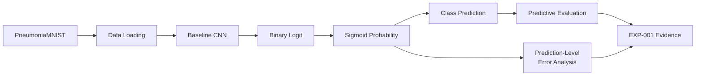
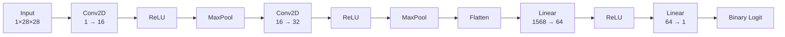
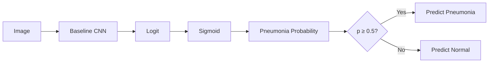
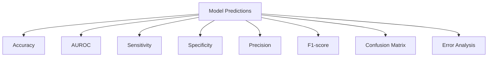
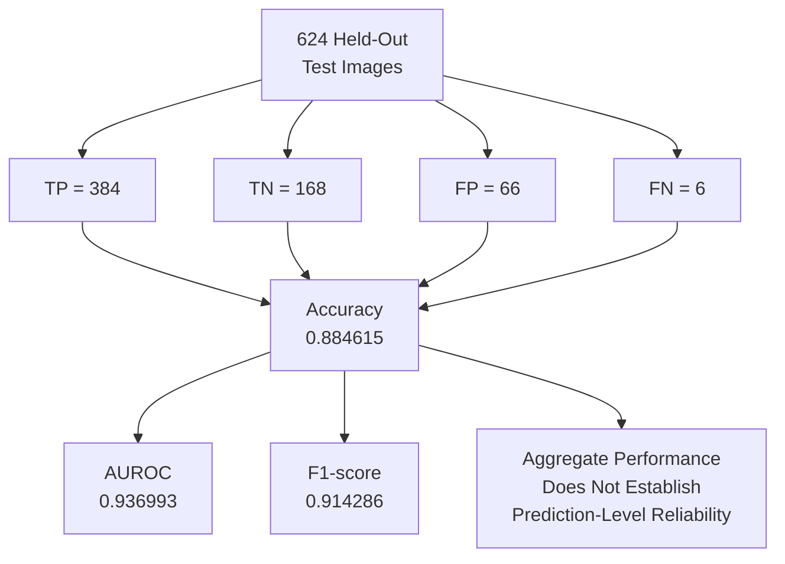
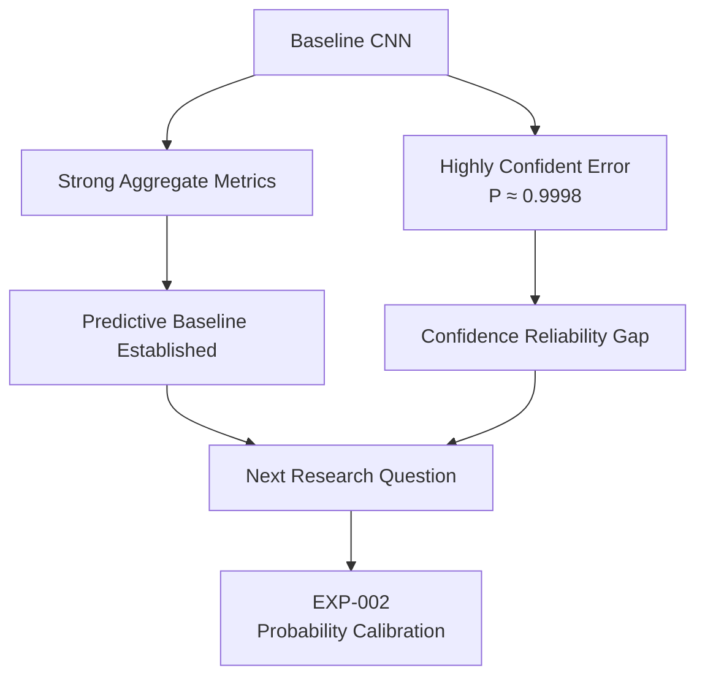
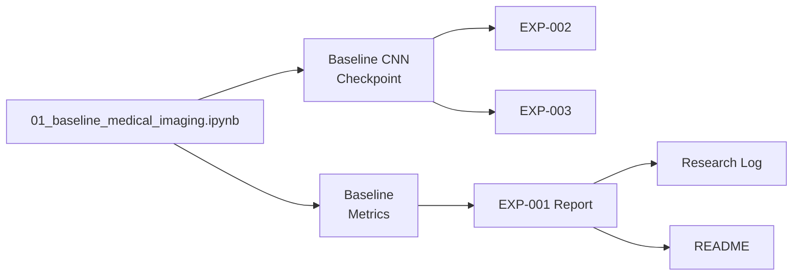
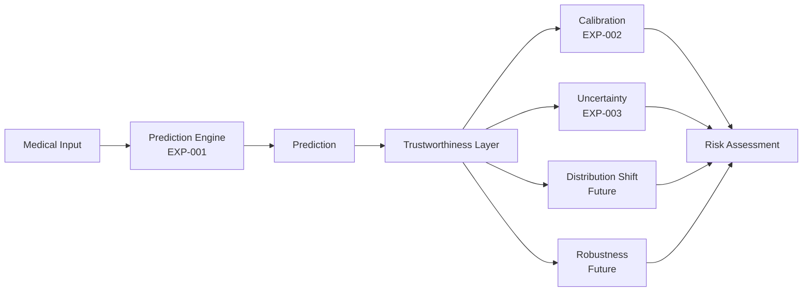
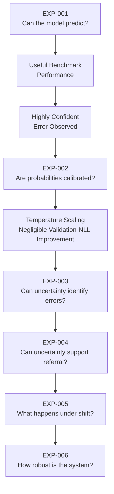
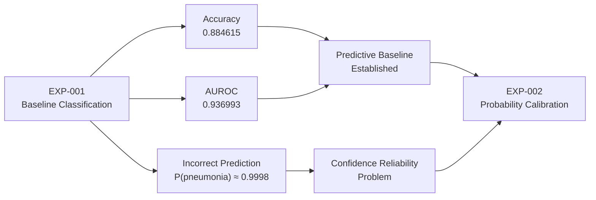

# EXP-001 — Baseline Medical Image Classification

**Project:** Trustworthy Healthcare AI  
**Experiment:** EXP-001  
**Research Stage:** Baseline Predictive Modelling  
**Status:** Complete  
**Dataset:** PneumoniaMNIST — MedMNIST v2  
**Successor:** EXP-002 — Probability Calibration  

---

## 1. Experiment Overview

EXP-001 establishes the predictive baseline for the Trustworthy Healthcare AI research programme.

The experiment investigates whether a compact convolutional neural network can distinguish pneumonia-positive from pneumonia-negative chest X-ray images using the PneumoniaMNIST benchmark.

The purpose of EXP-001 is not to demonstrate clinical readiness.

Instead, it establishes a controlled predictive baseline from which increasingly demanding trustworthiness questions can be investigated.

The research begins with:

> **Can the model make useful predictions?**

and subsequently progresses toward:

> **Can those predictions be trusted?**

---

## 2. Research Motivation

Trustworthiness analysis requires an underlying predictive model whose behaviour can be systematically evaluated.

EXP-001 therefore establishes:

- the initial medical-imaging task;
- the benchmark dataset;
- the baseline neural network;
- the training procedure;
- the evaluation framework;
- the saved model checkpoint;
- the initial predictive performance; and
- the prediction-level failure behaviour that motivates subsequent experiments.

The baseline is deliberately modest.

The objective is not to maximise benchmark performance immediately.

Instead, the experiment creates a reproducible foundation for studying:

```text
Prediction
    ↓
Calibration
    ↓
Uncertainty
    ↓
Selective Prediction
    ↓
Distribution Shift
    ↓
Robustness
    ↓
Multimodal Trustworthy AI
```

---

## 3. Primary Research Question

The primary research question is:

> **How effectively can a baseline convolutional neural network distinguish pneumonia-positive from pneumonia-negative chest X-ray images using the PneumoniaMNIST benchmark?**

A secondary research question is:

> **What potentially important failure behaviours remain hidden when the model is evaluated only through aggregate predictive metrics?**

The second question becomes particularly important for the later trustworthiness experiments.

---

## 4. Role of EXP-001 in the Research Programme


EXP-001 provides the predictive model and empirical baseline required by the subsequent experiments.

---

# 5. Dataset

The experiment uses **PneumoniaMNIST**, part of the MedMNIST v2 benchmark collection.

The task is binary medical-image classification.

Images have the following format:

```text
Grayscale
1 × 28 × 28
```

The target classes are:

| Label | Class |
|---:|---|
| 0 | Normal |
| 1 | Pneumonia |

PneumoniaMNIST provides a convenient controlled benchmark for research experimentation.

The benchmark should not be interpreted as a substitute for full-resolution clinical deployment data.

---

## 6. Dataset Splits

The predefined PneumoniaMNIST dataset splits are retained.

| Split | Samples | Purpose |
|---|---:|---|
| Training | 4,708 | Model fitting |
| Validation | 524 | Development evaluation |
| Test | 624 | Held-out final evaluation |
| **Total** | **5,856** | |

Using the predefined split structure improves comparability and reduces the risk of arbitrary train/test partitioning.

---

## 7. Training-Class Distribution

The training set contains:

| Class | Samples | Percentage |
|---|---:|---:|
| Normal | 1,214 | 25.79% |
| Pneumonia | 3,494 | 74.21% |
| **Total** | **4,708** | **100%** |

The approximate pneumonia-to-normal ratio is:

```text
2.88 : 1
```

The training data is therefore imbalanced toward the pneumonia class.

---

## 8. Why Class Imbalance Matters

A classifier can achieve deceptively high accuracy by favouring the majority class.

The majority-class proportion in the training set is approximately:

```text
74.21%
```

Accuracy alone would therefore provide an incomplete description of predictive performance.

EXP-001 consequently evaluates several complementary metrics:

- accuracy;
- AUROC;
- sensitivity;
- specificity;
- precision; and
- F1-score.

No resampling strategy was introduced for this baseline experiment.

The observed class distribution is retained as part of the baseline experimental conditions.

---

# 9. Experimental Design

The baseline experiment follows this pipeline:



This structure produces both aggregate predictive evidence and prediction-level observations.

---

## 10. Reproducibility Seed

The experiment uses:

```text
Random seed = 42
```

A fixed seed supports repeatability of stochastic operations within the experimental environment.

A seed alone does not guarantee identical results across every hardware and software configuration, but it reduces unnecessary experimental variation.

---

## 11. Data Loading

The data loaders use:

```text
Batch size = 64
```

Training data is shuffled.

Validation and test data are not shuffled during evaluation.

```text
Training
    ↓
shuffle = True

Validation
    ↓
shuffle = False

Test
    ↓
shuffle = False
```

This permits stochastic training while maintaining stable evaluation behaviour.

---

# 12. Baseline CNN Architecture

The baseline model is a compact convolutional neural network designed for the 28 × 28 grayscale input images.

The architecture is:

```text
Input
1 × 28 × 28
      ↓
Conv2D
1 → 16 channels
3 × 3 kernel
padding = 1
      ↓
ReLU
      ↓
MaxPool2D
      ↓
Conv2D
16 → 32 channels
3 × 3 kernel
padding = 1
      ↓
ReLU
      ↓
MaxPool2D
      ↓
Flatten
      ↓
Linear
32 × 7 × 7 → 64
      ↓
ReLU
      ↓
Linear
64 → 1
      ↓
Binary Logit
```

---

## 13. Architecture Visualisation



The architecture is intentionally simple enough to provide a clear and reproducible experimental baseline.

---

## 14. Model Definition

The implemented baseline model is:

```python
class BaselineCNN(nn.Module):
    def __init__(self):
        super().__init__()

        self.features = nn.Sequential(
            nn.Conv2d(1, 16, 3, padding=1),
            nn.ReLU(),
            nn.MaxPool2d(2),

            nn.Conv2d(16, 32, 3, padding=1),
            nn.ReLU(),
            nn.MaxPool2d(2),
        )

        self.classifier = nn.Sequential(
            nn.Flatten(),
            nn.Linear(32 * 7 * 7, 64),
            nn.ReLU(),
            nn.Linear(64, 1),
        )

    def forward(self, x):
        return self.classifier(self.features(x))
```

The final layer returns a raw binary logit.

Sigmoid is applied during probability generation rather than being embedded in the final model layer.

---

# 15. Training Methodology

## Loss Function

The experiment uses:

```text
BCEWithLogitsLoss
```

This combines binary cross-entropy with the sigmoid operation in a numerically stable implementation.

Conceptually:

```text
Model
   ↓
Raw Logit
   ↓
BCEWithLogitsLoss
   ↓
Training Objective
```

---

## 16. Optimiser

The model is trained using:

```text
Adam
```

with learning rate:

```text
0.001
```

The training configuration is intentionally straightforward.

EXP-001 is intended to establish a reproducible reference model rather than conduct exhaustive hyperparameter optimisation.

---

## 17. Training Duration

The model is trained for:

```text
10 epochs
```

No claim is made that 10 epochs represents a universally optimal training duration.

It is the experimental configuration used to produce the baseline checkpoint evaluated in EXP-001.

---

## 18. Training Configuration Summary

| Component | Configuration |
|---|---|
| Dataset | PneumoniaMNIST |
| Task | Binary classification |
| Input | 1 × 28 × 28 grayscale |
| Batch size | 64 |
| Random seed | 42 |
| Model | Baseline CNN |
| Loss | BCEWithLogitsLoss |
| Optimiser | Adam |
| Learning rate | 0.001 |
| Epochs | 10 |
| Training resampling | None |

---

# 19. Prediction Pipeline

During evaluation:



The standard probability threshold of 0.5 is used for binary class prediction.

---

# 20. Evaluation Framework

Because the dataset is imbalanced, no single metric is considered sufficient.

The evaluation therefore examines complementary aspects of model performance.



---

## 21. Accuracy

Accuracy measures the proportion of all predictions that are correct.

\[
Accuracy =
\frac{TP + TN}
{TP + TN + FP + FN}
\]

Because of class imbalance, accuracy is interpreted alongside the other metrics rather than independently.

---

## 22. Sensitivity

Sensitivity measures the proportion of pneumonia-positive cases correctly identified.

\[
Sensitivity =
\frac{TP}
{TP + FN}
\]

High sensitivity indicates that relatively few positive pneumonia examples are missed.

---

## 23. Specificity

Specificity measures the proportion of normal cases correctly identified.

\[
Specificity =
\frac{TN}
{TN + FP}
\]

Comparing sensitivity with specificity helps reveal asymmetric classification behaviour.

---

## 24. Precision

Precision measures the proportion of pneumonia predictions that are actually pneumonia-positive.

\[
Precision =
\frac{TP}
{TP + FP}
\]

Precision therefore captures the effect of false-positive predictions.

---

## 25. F1-Score

F1-score is the harmonic mean of precision and recall.

\[
F1 =
2
\frac{Precision \times Recall}
{Precision + Recall}
\]

It provides a combined measure of precision and sensitivity.

---

## 26. AUROC

Area Under the Receiver Operating Characteristic Curve evaluates discrimination across classification thresholds.

It measures the model's ability to rank positive examples above negative examples.

AUROC therefore complements threshold-dependent metrics such as accuracy and F1-score.

---

# 27. Held-Out Test Results

The baseline CNN produced the following verified held-out test results:

| Metric | Result |
|---|---:|
| Accuracy | **0.884615** |
| AUROC | **0.936993** |
| Sensitivity | **0.9846** |
| Specificity | **0.7179** |
| Precision | **0.8533** |
| F1-score | **0.914286** |

These values establish the quantitative baseline for subsequent trustworthiness experiments.

---

# 28. Confusion Matrix

The held-out test confusion matrix is:

| | Predicted Normal | Predicted Pneumonia |
|---|---:|---:|
| **Actual Normal** | TN = 168 | FP = 66 |
| **Actual Pneumonia** | FN = 6 | TP = 384 |

The total number of predictions is:

```text
168 + 66 + 6 + 384 = 624
```

which matches the held-out test-set size.

---

## 29. Confusion Matrix Interpretation

The model correctly identifies:

```text
384 pneumonia cases
168 normal cases
```

while producing:

```text
6 false negatives
66 false positives
```

The resulting sensitivity is substantially higher than specificity:

```text
Sensitivity = 0.9846
Specificity = 0.7179
```

Under the evaluated conditions, the model is therefore substantially better at identifying pneumonia-positive examples than correctly rejecting normal examples.

---

## 30. Visual Result Summary



---

# 31. Comparison With Majority-Class Reference

The majority class represents approximately:

```text
74.21%
```

of the training data.

The CNN's held-out accuracy is approximately:

```text
88.46%
```

The baseline CNN therefore performs substantially above a simplistic majority-class accuracy reference.

However, exceeding the majority-class reference does not establish trustworthiness.

---

## 32. Important Performance Pattern

One particularly important pattern is:

```text
Sensitivity
0.9846

versus

Specificity
0.7179
```

The model detects most pneumonia-positive examples but produces substantially more false positives than false negatives.

This demonstrates why aggregate accuracy alone is insufficient for understanding model behaviour.

---

# 33. Prediction-Level Error Analysis

Aggregate metrics answer:

> **How well does the model perform overall?**

They do not fully answer:

> **What happens when the model is wrong?**

EXP-001 therefore includes prediction-level error analysis.

This analysis produced the observation that became the main motivation for the next research stage.

---

# 34. High-Confidence Incorrect Prediction

An incorrectly classified normal image was observed with approximately:

```text
P(pneumonia) ≈ 0.9998
```

Conceptually:


This observation is central to the research progression.

---

## 35. Why the High-Confidence Error Matters

If evaluation stopped at:

```text
Accuracy ≈ 88.46%
AUROC ≈ 0.9370
F1 ≈ 0.9143
```

the baseline could appear highly satisfactory for a benchmark experiment.

However:

```text
Strong aggregate performance
             ≠
Reliable individual confidence
```

A model can be:

```text
Correct frequently
      +
Extremely confident when wrong
```

This behaviour creates a meaningful trustworthiness problem.

---

# 36. From Prediction Performance to Trustworthiness

The high-confidence error changes the research question.

Initially:

```text
Can the model classify pneumonia?
```

After EXP-001:

```text
The model demonstrates useful
benchmark predictive performance.

But...

Can its probability estimates
be trusted?
```

This question leads directly to EXP-002.

---

## 37. Evidence-Driven Transition to EXP-002



EXP-002 is therefore motivated by an empirical observation rather than simply being added because calibration is a common trustworthy-AI technique.

---

# 38. Scientific Interpretation

EXP-001 demonstrates that a compact CNN can achieve useful predictive performance on the PneumoniaMNIST benchmark.

The model achieved:

- accuracy above the majority-class reference;
- strong AUROC;
- very high sensitivity;
- strong F1-score; and
- lower specificity than sensitivity.

Prediction-level analysis additionally exposed a highly confident incorrect classification.

The appropriate interpretation is therefore:

> **The baseline model provides a useful predictive foundation for trustworthiness research, but strong aggregate performance does not establish reliable prediction-level confidence.**

This conclusion motivates the subsequent calibration and uncertainty experiments.

---

# 39. What EXP-001 Does Not Establish

EXP-001 does **not** establish that:

- the model is clinically deployable;
- the model is safe for diagnosis;
- the model generalises across hospitals;
- the model generalises across patient populations;
- the model is well calibrated;
- model uncertainty is reliable;
- the model is robust under distribution shift;
- the model is robust to perturbations;
- benchmark performance implies clinical usefulness; or
- the model has undergone clinical validation.

Each of these claims would require additional evidence.

---

# 40. Limitations

### Benchmark Dataset

PneumoniaMNIST is a controlled benchmark and does not capture the full complexity of real clinical imaging environments.

### Low Image Resolution

Images are:

```text
28 × 28
```

which is substantially lower than typical clinical imaging resolution.

### Single Task

The experiment evaluates one binary classification task.

### Single Architecture

Only the baseline CNN is evaluated.

### Class Imbalance

The training distribution is skewed toward pneumonia-positive examples.

### Limited Hyperparameter Exploration

The baseline was not developed through exhaustive hyperparameter optimisation.

### No External Validation

The model was not evaluated on an independent external institutional dataset.

### No Calibration Evaluation

Probability calibration is investigated separately in EXP-002.

### No Explicit Uncertainty Quantification

Prediction-level uncertainty is investigated in EXP-003.

### No Distribution-Shift Evaluation

Distribution shift is reserved for a later experiment.

### No Clinical Validation

The results should not be interpreted as evidence of clinical readiness.

---

# 41. Reproducibility

The experiment is associated with the project's reproducible research environment.

Core tools include:

```text
Python 3.11
uv
PyTorch
torchvision
NumPy
pandas
scikit-learn
matplotlib
MedMNIST
```

Key configuration:

| Parameter | Value |
|---|---:|
| Random seed | 42 |
| Batch size | 64 |
| Learning rate | 0.001 |
| Epochs | 10 |

---

## 42. Primary Experiment Notebook

The primary executable experiment is:

```text
notebooks/01_baseline_medical_imaging.ipynb
```

The notebook contains the baseline implementation and experimental analysis.

---

## 43. Saved Model Artifact

The trained baseline checkpoint is stored as:

```text
results/models/experiment_001_baseline_cnn.pt
```

This checkpoint provides continuity between experiments.

The subsequent calibration and deterministic uncertainty analyses can therefore investigate the same underlying predictive model rather than silently replacing it.

---

## 44. Metrics Artifact

The baseline metrics are stored as:

```text
results/tables/experiment_001_baseline_metrics.csv
```

The documented quantitative results should remain consistent with the saved experimental artifact.

---

# 45. Research Artifact Chain



This traceability is important because later experiments depend on the baseline model.

---

# 46. System Capability Contribution

From the system-engineering perspective, EXP-001 establishes the project's first validated capability:

```text
Medical Image
     ↓
Baseline CNN
     ↓
Pneumonia Probability
     ↓
Binary Prediction
```

This forms the initial:

> **Prediction Engine**

within the broader research architecture.

However, prediction is only one component of the intended trustworthy research system.

---

# 47. Trustworthiness Layer Still Required

The broader architecture requires additional reliability mechanisms.



EXP-001 establishes the predictive component but does not validate this broader trustworthiness layer.

---

# 48. Research Progression

The evidence-driven sequence is:



Each stage addresses a question left unresolved by the previous stage.

---

# 49. Experiment Integrity Principles

EXP-001 establishes several principles that continue throughout the project:

1. Predefined benchmark splits are retained.
2. Held-out test performance is reported separately from model training.
3. Class imbalance is explicitly acknowledged.
4. Multiple predictive metrics are reported.
5. Prediction-level failures are not hidden by aggregate performance.
6. The trained checkpoint is preserved for subsequent experiments.
7. Benchmark performance is not presented as clinical validation.
8. Limitations accompany positive findings.
9. Subsequent experiments are motivated by evidence rather than added arbitrarily.

---

# 50. Main Finding

The principal finding from EXP-001 is:

> **The baseline CNN achieved strong benchmark discrimination and high sensitivity on PneumoniaMNIST, but prediction-level analysis revealed that strong aggregate performance can coexist with highly confident incorrect predictions.**

The experiment therefore establishes both:

```text
A useful predictive baseline
            +
A trustworthiness problem
worth investigating
```

---

# 51. Research Implication

EXP-001 moves the project beyond a conventional classification exercise.

The model is capable of producing useful benchmark predictions.

The more important question becomes:

> **When should those predictions be trusted?**

The first step toward investigating that question is probability calibration.

---

# 52. Connection to EXP-002



The high-confidence failure provides the direct empirical motivation for EXP-002.

---

# 53. Experiment Status

| Component | Status |
|---|---|
| Dataset preparation | Complete |
| Baseline CNN implementation | Complete |
| Model training | Complete |
| Held-out evaluation | Complete |
| Predictive metrics | Complete |
| Confusion matrix analysis | Complete |
| Prediction-level error analysis | Complete |
| Model checkpoint saved | Complete |
| Metrics artifact saved | Complete |
| Probability calibration | EXP-002 |
| Uncertainty quantification | EXP-003 |
| Selective prediction | Future experiment |
| Distribution-shift evaluation | Future experiment |
| Robustness evaluation | Future experiment |
| Clinical validation | Not performed |

---

# 54. Final Conclusion

EXP-001 established the predictive foundation for the Trustworthy Healthcare AI research programme.

Using the PneumoniaMNIST benchmark, a compact convolutional neural network was trained for binary pneumonia classification.

The model achieved:

```text
Accuracy:     0.884615
AUROC:        0.936993
Sensitivity:  0.9846
Specificity:  0.7179
Precision:    0.8533
F1-score:     0.914286
```

The held-out confusion matrix was:

```text
TN = 168
FP = 66
FN = 6
TP = 384
```

These results establish a useful predictive baseline.

However, the most important observation from the experiment was not simply the aggregate performance.

An incorrectly classified normal image received approximately:

```text
P(pneumonia) ≈ 0.9998
```

demonstrating that strong benchmark performance can coexist with highly confident individual errors.

That observation creates the first major trustworthiness question in the project:

> **Can the model's probability estimates be trusted?**

This question directly motivates:

> **EXP-002 — Probability Calibration**

EXP-001 therefore serves two important roles:

1. it establishes the project's baseline medical-image prediction engine; and
2. it provides empirical failure evidence that motivates the subsequent trustworthiness research.

---

**Experiment Status:** Complete  
**Primary Contribution:** Baseline medical-image prediction engine and failure analysis  
**Key Trustworthiness Observation:** Highly confident incorrect prediction identified  
**Next Experiment:** EXP-002 — Probability Calibration
