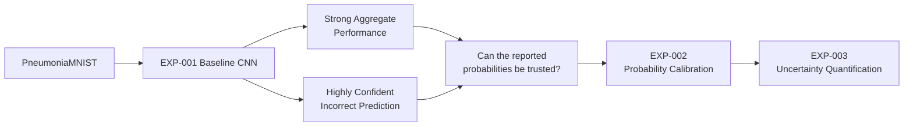
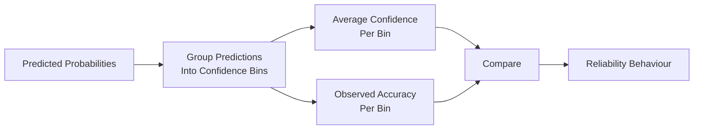
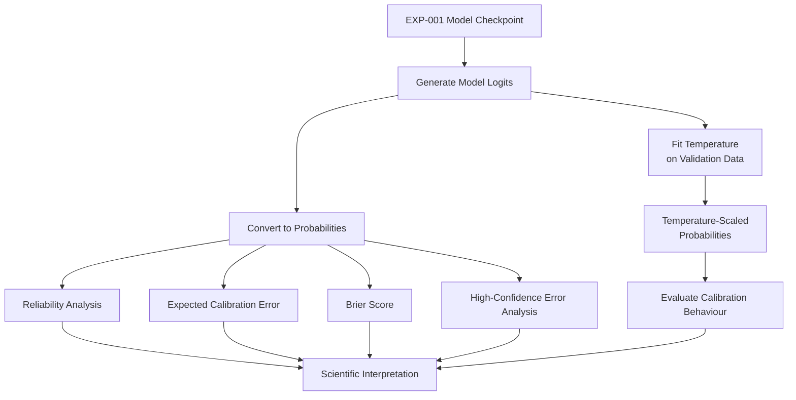
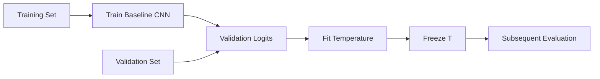
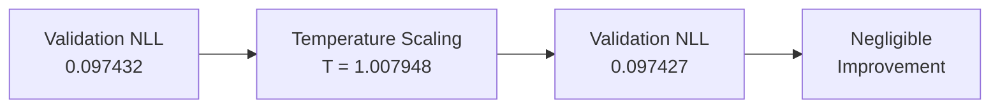
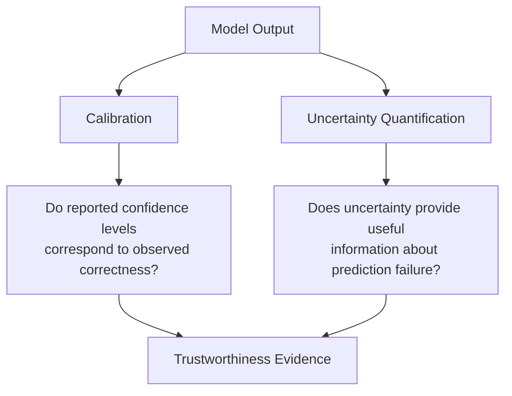
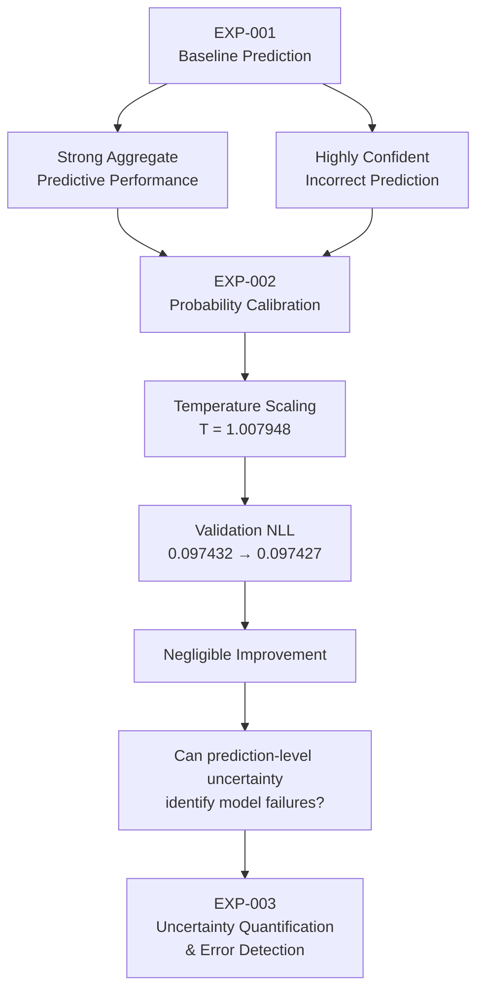
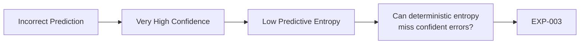
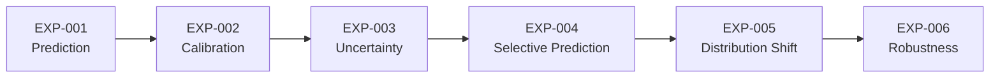
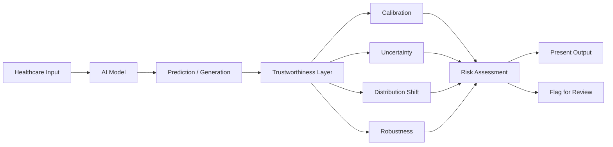

# EXP-002 — Probability Calibration

**Project:** Trustworthy Healthcare AI  
**Experiment:** EXP-002  
**Research Stage:** Probability Calibration  
**Status:** Complete  
**Predecessor:** EXP-001 — Baseline Medical Image Classification  
**Successor:** EXP-003 — Uncertainty Quantification and Error Detection  

---

## 1. Experiment Overview

EXP-002 investigates the probability reliability of the baseline medical-image classifier developed in EXP-001.

EXP-001 demonstrated strong aggregate predictive performance on the PneumoniaMNIST benchmark. However, error analysis revealed an important trustworthiness concern: the model could make an incorrect prediction while assigning extremely high probability to that prediction.

This motivated a transition from asking only:

> **Is the predicted class correct?**

to also asking:

> **Do the model's probability estimates provide reliable information about predictive confidence?**

EXP-002 therefore evaluates probability calibration and investigates whether post-hoc temperature scaling can improve the probabilistic behaviour of the existing classifier without retraining it.

---

## 2. Research Motivation

Predictive accuracy alone is not sufficient for trustworthy healthcare AI.

Consider two model outputs:

```text
Prediction A
P(pneumonia) = 0.60

Prediction B
P(pneumonia) = 0.99
```

At a decision threshold of 0.5, both predictions may produce the same class label.

However, the probability values communicate very different levels of model confidence.

For probability estimates to be useful in reliability-sensitive systems, reported confidence should meaningfully correspond to observed correctness.

A model that produces highly confident incorrect predictions may therefore present reliability concerns even when its aggregate discrimination metrics are strong.

---

## 3. Research Question

The primary research question for EXP-002 is:

> **How well calibrated are the probability estimates produced by the baseline CNN for pneumonia classification, and does the model exhibit overconfidence when making incorrect predictions?**

A secondary methodological question is:

> **Can post-hoc temperature scaling improve the probability calibration of the existing model without retraining the classifier?**

---

## 4. Evidence From EXP-001

EXP-001 established the predictive baseline.

The held-out test performance was:

| Metric | Result |
|---|---:|
| Accuracy | 0.884615 |
| AUROC | 0.936993 |
| Sensitivity | 0.9846 |
| Specificity | 0.7179 |
| Precision | 0.8533 |
| F1-score | 0.914286 |

These results demonstrated useful discrimination on the PneumoniaMNIST benchmark.

However, aggregate metrics did not fully describe prediction-level reliability.

During error analysis, an incorrectly classified normal image received approximately:

```text
P(pneumonia) ≈ 0.9998
```

This highly confident error provided the direct motivation for investigating calibration.

---

## 5. Research Progression



EXP-002 therefore follows directly from evidence generated in EXP-001 rather than being an isolated experiment.

---

## 6. Dataset

EXP-002 uses the same PneumoniaMNIST benchmark and predefined dataset splits used in EXP-001.

| Split | Samples | Purpose |
|---|---:|---|
| Training | 4,708 | Original model training |
| Validation | 524 | Calibration fitting |
| Test | 624 | Held-out evaluation |
| **Total** | **5,856** | |

The predefined split structure was preserved.

No resampling was introduced specifically for the calibration experiment.

---

## 7. Existing Model

EXP-002 reuses the trained CNN checkpoint from EXP-001.

The purpose is to evaluate and recalibrate the probabilities produced by the existing classifier rather than train a new predictive model.


The underlying classifier weights remain unchanged during post-hoc temperature scaling.

---

## 8. Accuracy and Calibration Are Different Questions

Accuracy answers:

> **How often is the thresholded class prediction correct?**

Calibration asks:

> **How well do reported confidence levels correspond to observed correctness?**

A model can therefore exhibit:

```text
Strong Classification Performance
              +
Imperfect Probability Reliability
```

The two properties should not be treated as interchangeable.

---

## 9. Discrimination and Calibration Are Also Different

AUROC evaluates how effectively model scores rank positive cases above negative cases.

Calibration evaluates the numerical reliability of the probability estimates themselves.

Conceptually:

```text
Discrimination
      ↓
Can the model rank cases effectively?


Calibration
      ↓
Can the probability values be interpreted reliably?
```

A calibration method is therefore not primarily intended to improve discrimination.

---

## 10. Calibration Evaluation Framework

EXP-002 considers several complementary aspects of probability reliability:

- reliability analysis;
- Expected Calibration Error;
- Brier score;
- confidence behaviour;
- high-confidence errors; and
- post-hoc temperature scaling.

No single metric is treated as a complete description of model reliability.

---

## 11. Reliability Analysis

A reliability diagram compares predicted confidence with empirical correctness.

Conceptually:



For a well-calibrated model, predicted confidence should approximately correspond to empirical accuracy.

For example:

```text
Predicted confidence ≈ 0.80
              ↓
Observed correctness ≈ 80%
```

Systematic differences between confidence and observed correctness indicate calibration error.

---

## 12. Expected Calibration Error

Expected Calibration Error (ECE) summarises differences between confidence and empirical accuracy across confidence bins.

A common formulation is:

\[
ECE =
\sum_{m=1}^{M}
\frac{|B_m|}{n}
\left|
acc(B_m)-conf(B_m)
\right|
\]

where:

- \(B_m\) represents calibration bin \(m\);
- \(acc(B_m)\) is empirical accuracy within that bin;
- \(conf(B_m)\) is average confidence within that bin; and
- \(n\) is the number of evaluated predictions.

Lower ECE generally indicates closer agreement between confidence and observed correctness under the selected binning procedure.

However, ECE depends on binning choices and should not be interpreted in isolation.

---

## 13. Brier Score

The Brier score measures squared error between predicted probabilities and observed binary outcomes.

For binary classification:

\[
BS =
\frac{1}{N}
\sum_{i=1}^{N}
(p_i-y_i)^2
\]

where:

- \(p_i\) is the predicted probability;
- \(y_i\) is the observed binary outcome; and
- \(N\) is the number of evaluated observations.

Unlike classification accuracy, the Brier score evaluates the quality of the probability estimates themselves.

Lower values indicate smaller probability error.

---

## 14. High-Confidence Error Analysis

EXP-002 also considers predictions that are simultaneously:

```text
Incorrect
    +
High Confidence
```

For binary prediction, confidence can be represented as:

\[
confidence = \max(p,1-p)
\]

A high-confidence error is therefore a prediction where the model is not only wrong but strongly committed to the incorrect class.

This is particularly important in trustworthy AI because downstream users or systems may interpret highly confident predictions as more reliable.

---

## 15. Calibration Experiment Flow



---

## 16. Temperature Scaling

Temperature scaling is a post-hoc calibration technique.

Given a model logit \(z\), a temperature-scaled probability is:

\[
p =
\sigma\left(\frac{z}{T}\right)
\]

where:

- \(z\) is the original model logit;
- \(T\) is a learned positive scalar temperature; and
- \(\sigma\) is the sigmoid function.

The model parameters themselves are not retrained.

Only the scale of the logits is adjusted.

---

## 17. Interpretation of Temperature

Conceptually:

```text
T > 1
    ↓
Logits become less extreme
    ↓
Probabilities become softer


T < 1
    ↓
Logits become more extreme
    ↓
Probabilities become sharper


T ≈ 1
    ↓
Very little global adjustment
```

A fitted temperature close to 1 therefore indicates that the optimisation procedure identified only a small global rescaling of the original logits.

---

## 18. Validation-Based Temperature Fitting

Temperature is a learned calibration parameter.

It must therefore be estimated without using the held-out test set for parameter fitting.

The experimental structure is:



This preserves the distinction between model/calibration development and held-out evaluation.

---

## 19. Positive Temperature Constraint

Temperature must remain positive.

A suitable implementation can optimise a log-temperature parameter:

\[
T = \exp(\theta)
\]

which guarantees:

\[
T > 0
\]

throughout optimisation.

This prevents invalid negative temperature values.

---

## 20. Calibration Optimisation Objective

Temperature fitting uses validation negative log-likelihood as the optimisation objective.

The goal is to identify a scalar temperature that improves the probabilistic fit of the existing model outputs on validation data.

The corrected optimisation procedure produced:

\[
T = 1.007948
\]

The fitted temperature is very close to 1.

---

# 21. Final Verified Calibration Result

The final corrected and verified calibration-fitting evidence is:

| Quantity | Result |
|---|---:|
| Fitted temperature | **1.007948** |
| Validation NLL before scaling | **0.097432** |
| Validation NLL after scaling | **0.097427** |
| Absolute NLL change | **-0.000005** |

The observed improvement in validation negative log-likelihood was therefore negligible.



This is the principal corrected quantitative result retained from the temperature-fitting procedure.

---

## 22. Evidence-Provenance Note

Earlier exploratory calibration work produced preliminary post-scaling test values.

The temperature-optimisation procedure was subsequently corrected.

For this reason, those earlier preliminary post-scaling test values are **not presented as final corrected experimental evidence in this report**.

The final evidence currently treated as verified is:

```text
Temperature
T = 1.007948

Validation NLL
Before = 0.097432
After  = 0.097427
Change = -0.000005
```

Exact corrected post-scaling test calibration metrics should be reported only after they are confirmed from the final corrected evaluation artifact.

This distinction preserves experimental provenance and prevents preliminary outputs from being represented as final results.

---

## 23. Scientific Interpretation

The fitted temperature:

```text
T = 1.007948
```

is extremely close to the identity transformation:

```text
T = 1
```

Similarly, validation negative log-likelihood changed only from:

```text
0.097432
```

to:

```text
0.097427
```

The appropriate interpretation is therefore:

> **Global temperature scaling produced negligible improvement in validation negative log-likelihood for this model under the evaluated experimental conditions.**

The conclusion is intentionally limited to the evidence generated by this experiment.

---

## 24. What the Result Does Not Establish

EXP-002 does **not** establish that:

- temperature scaling is generally ineffective;
- temperature scaling does not work in medical AI;
- the baseline model is perfectly calibrated;
- calibration is unnecessary;
- high-confidence errors have been eliminated;
- the model is clinically trustworthy;
- uncertainty has been fully quantified; or
- the result generalises to other datasets or healthcare environments.

The findings apply to the current model, dataset and experimental procedure.

---

## 25. Why Temperature Scaling Does Not Target Accuracy

For positive temperature \(T\):

\[
sign(z/T)=sign(z)
\]

For binary classification with a 0.5 decision threshold:

```text
z > 0
    ↓
p > 0.5

z < 0
    ↓
p < 0.5
```

Positive temperature scaling therefore preserves the sign of binary logits.

Its primary purpose is probability calibration rather than changing thresholded class decisions.

Consequently, classification accuracy improvement is not the principal objective of temperature scaling.

---

## 26. Why Temperature Scaling Does Not Target AUROC

Positive temperature scaling is a monotonic transformation of the logits.

It preserves their ordering.

Because AUROC primarily evaluates ranking, substantial AUROC improvement is not the intended objective of temperature scaling.

This reinforces the distinction between:

```text
Discrimination
       and
Calibration
```

---

## 27. Remaining Trustworthiness Question

EXP-002 addresses population-level probability reliability, but a different question remains:

> **Can the model identify when an individual prediction may be unreliable?**

Consider:

```text
Model Prediction
      ↓
Very High Probability
      ↓
Low apparent ambiguity
      ↓
But prediction may still be wrong
```

Calibration alone does not provide a complete answer to this prediction-level reliability problem.

---

## 28. Calibration and Uncertainty Are Complementary



Calibration and uncertainty quantification therefore address related but distinct reliability questions.

---

## 29. Why EXP-003 Follows EXP-002

The research progression now becomes:



EXP-003 is therefore motivated by an unresolved reliability question rather than by a predetermined desire to add another technique.

---

## 30. Next Research Question

EXP-003 asks:

> **Does predictive uncertainty provide useful information for distinguishing incorrect from correct predictions produced by the baseline medical-image classifier?**

The initial uncertainty baseline will be deterministic binary predictive entropy.

For predicted probability \(p\):

\[
H(p)
=
-p\log(p)
-
(1-p)\log(1-p)
\]

The key question is not merely whether entropy can be calculated.

The experiment will investigate whether higher uncertainty actually corresponds to increased likelihood of prediction error.

---

## 31. Why High-Confidence Errors Matter for EXP-003

Predictive entropy is highest near:

```text
p = 0.5
```

and becomes small as:

```text
p → 0
```

or:

```text
p → 1
```

Therefore an incorrect prediction with:

```text
P(pneumonia) ≈ 0.9998
```

would be expected to have very low probability-derived predictive entropy.

This creates an important research question:



If such behaviour is observed systematically, it would motivate investigation of richer uncertainty-estimation methods.

---

## 32. Broader Research Progression



Each experiment addresses a distinct question about model trustworthiness.

---

## 33. System Capability Progression

The experiments also contribute incrementally to the intended research system.

```text
EXP-001
    ↓
Prediction Engine

EXP-002
    ↓
Calibration Evaluation Layer

EXP-003
    ↓
Candidate Uncertainty Engine

EXP-004
    ↓
Selective Prediction / Referral

EXP-005
    ↓
Distribution-Shift Evaluation

EXP-006
    ↓
Robustness Evaluation
```

A component should become part of the integrated research prototype only when its behaviour has been evaluated and its limitations are understood.

---

## 34. Reproducibility

EXP-002 is tied to the project's reproducible research environment.

Core environment:

```text
Python 3.11
uv
PyTorch
torchvision
NumPy
pandas
scikit-learn
matplotlib
MedMNIST
```

The experiment should remain traceable to:

- the EXP-001 model architecture;
- the EXP-001 checkpoint;
- PneumoniaMNIST;
- predefined dataset splits;
- the probability-generation procedure;
- the temperature-scaling implementation;
- the validation fitting procedure;
- the corrected fitted temperature; and
- the corresponding Git history.

---

## 35. Experiment Integrity Principles

The following principles govern EXP-002:

1. The existing classifier is reused rather than silently replaced.
2. Temperature is fitted using validation data.
3. Held-out test data is not used to fit the calibration parameter.
4. Preliminary results are distinguished from corrected verified evidence.
5. Negligible results are reported rather than hidden.
6. Calibration is not equated with complete uncertainty quantification.
7. Benchmark results are not described as clinical validation.
8. Conclusions remain limited to the evaluated experimental setting.

---

## 36. Limitations

### Single benchmark dataset

EXP-002 evaluates PneumoniaMNIST only.

Calibration behaviour may differ across datasets, hospitals, devices and patient populations.

### Single baseline architecture

The findings concern the CNN used in EXP-001.

Different model architectures may exhibit different probability behaviour.

### Global calibration method

Temperature scaling learns one scalar temperature.

A single global transformation may not address more complex or subgroup-specific calibration behaviour.

### Benchmark rather than deployment setting

PneumoniaMNIST provides a controlled benchmark but does not reproduce the full complexity of real clinical deployment.

### No distribution-shift evaluation

EXP-002 does not establish whether calibration remains stable when the input distribution changes.

Distribution shift will be investigated separately.

### Calibration is not complete uncertainty quantification

Probability calibration does not quantify all sources of uncertainty, particularly epistemic uncertainty arising from limited model knowledge.

### No clinical validation

The experiment does not establish diagnostic safety, regulatory compliance or clinical readiness.

---

## 37. Main Verified Finding

The principal verified result of EXP-002 is:

> **Validation-fitted global temperature scaling produced a temperature of 1.007948 and changed validation negative log-likelihood from 0.097432 to 0.097427, representing negligible improvement under the evaluated conditions.**

This is a scientifically valid negligible result.

It does not need to be converted into a positive result to be useful.

Instead, it helps determine what should be investigated next.

---

## 38. Research Implication

The evidence moves the project from:

```text
Can we improve confidence reliability
through global probability rescaling?
```

toward:

```text
Can an uncertainty estimate provide
useful information about model failure?
```

That transition defines EXP-003.

---

## 39. Relationship to the Final Research System

The long-term research architecture contains several complementary trustworthiness mechanisms.



EXP-002 contributes evidence toward the **calibration evaluation component**.

It does not independently validate the complete trustworthiness layer.

---

## 40. Experiment Artifacts

Primary experimental notebook:

```text
notebooks/02_confidence_calibration.ipynb
```

Baseline model checkpoint:

```text
results/models/experiment_001_baseline_cnn.pt
```

Calibration-related tables and figures should only be listed as final artifacts after their presence and provenance have been verified in the repository.

This report intentionally avoids claiming that an expected artifact exists unless it has been confirmed.

---

## 41. Experiment Status

| Component | Status |
|---|---|
| EXP-001 model reused | Complete |
| Calibration analysis | Complete |
| Temperature scaling implementation | Complete |
| Validation temperature fitting | Complete |
| Corrected temperature verified | Complete |
| Corrected validation NLL verified | Complete |
| Preliminary post-scaling test metrics treated as final | **No** |
| Prediction-level uncertainty evaluation | EXP-003 |
| Distribution-shift evaluation | Future experiment |
| Robustness evaluation | Future experiment |
| Clinical validation | Not performed |

---

## 42. Final Conclusion

EXP-002 investigated probability calibration as the second stage of the Trustworthy Healthcare AI research programme.

The experiment was motivated by evidence from EXP-001 showing that strong aggregate classification performance can coexist with highly confident individual errors.

The existing baseline CNN was retained, and post-hoc temperature scaling was investigated without retraining the classifier.

The corrected calibration procedure produced:

```text
Fitted temperature:
T = 1.007948

Validation NLL:
Before = 0.097432
After  = 0.097427
Change = -0.000005
```

The observed improvement was negligible.

This result should not be interpreted as evidence that calibration is generally ineffective or that temperature scaling is unsuitable for healthcare AI.

Instead, the evidence supports the narrower conclusion that **global temperature scaling provided negligible validation-NLL improvement for this model under the evaluated experimental conditions**.

More importantly, probability calibration does not answer whether prediction-level uncertainty can identify unreliable model outputs.

That unresolved question provides the direct scientific motivation for:

> **EXP-003 — Uncertainty Quantification and Error Detection**

---

**Experiment Status:** Complete  
**Primary Verified Calibration Evidence:** `T = 1.007948`; validation NLL `0.097432 → 0.097427`  
**Next Experiment:** EXP-003 — Uncertainty Quantification and Error Detection
