# System Architecture

## Trustworthy Healthcare AI Research Platform

This document describes the evolving system architecture for the **Trustworthy Healthcare AI** research programme.

The architecture is intentionally **evidence-driven**.

Components are not treated as established system capabilities simply because they appear in the target architecture. Each major trustworthiness capability must first be investigated experimentally, evaluated, documented, and supported by evidence.

The system therefore develops through the following principle:

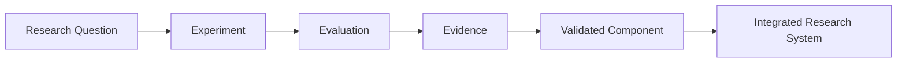

> **Research evidence comes before system integration.**

---

# 1. Architecture at a Glance

The long-term objective is an integrated **multimodal trustworthy healthcare AI research prototype** capable of processing different forms of healthcare information while evaluating the reliability of its outputs.

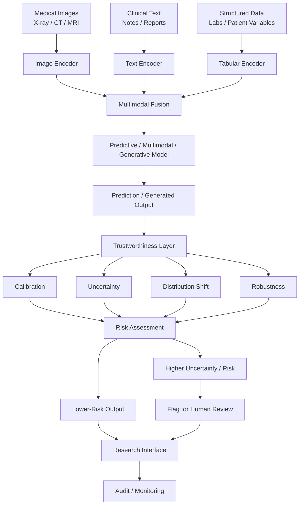

This diagram represents the **target research architecture**, not the current implementation state.

---

# 2. Current Implementation State

The project is currently much smaller than the target architecture.

The implemented research pipeline is:

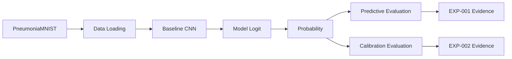

Currently established:

| Capability | Evidence | Status |
|---|---|---|
| Medical-image input | PneumoniaMNIST | Implemented |
| Binary image classification | EXP-001 | Implemented |
| Predictive evaluation | EXP-001 | Implemented |
| Probability calibration analysis | EXP-002 | Implemented |
| Temperature scaling investigation | EXP-002 | Implemented |
| Explicit uncertainty quantification | EXP-003 | Next |
| Selective prediction / referral | EXP-004 | Planned |
| Distribution-shift evaluation | EXP-005 | Planned |
| Robustness evaluation | EXP-006 | Planned |
| Multimodal modelling | Future research | Not implemented |
| Generative / VLM capability | Future research | Not implemented |
| Integrated research interface | Future system stage | Not implemented |

This distinction prevents the architecture from overstating what the repository currently demonstrates.

---

# 3. Research-to-System Progression

Each experiment answers a research question while also preparing a future system capability.

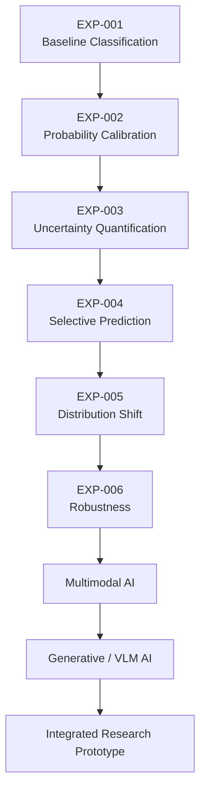

Current position:

```text
EXP-001  ✅ Complete
    ↓
EXP-002  ✅ Complete
    ↓
EXP-003  🔬 Next
    ↓
EXP-004  📋 Planned
    ↓
EXP-005  📋 Planned
    ↓
EXP-006  📋 Planned
```

The roadmap may change if experimental evidence justifies a different research direction.

---

# 4. Capability Evidence Map

The architecture connects research evidence to system capabilities.

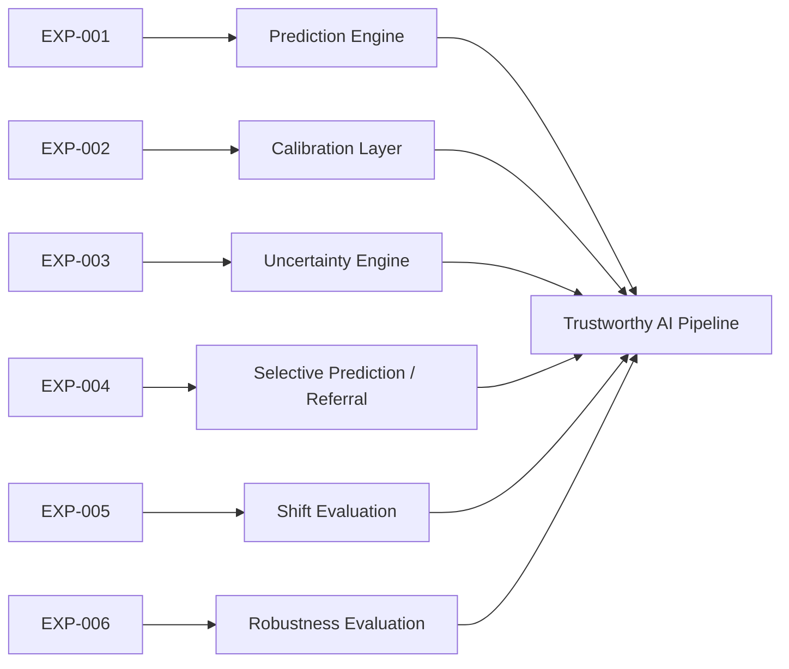

Importantly, a component is not considered validated merely because an experiment exists.

The experiment must produce interpretable evidence supporting its intended use.

---

# 5. EXP-001 — Prediction Engine

EXP-001 established the initial predictive component.

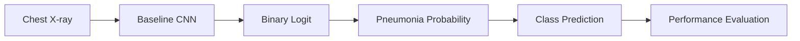

The model demonstrated strong predictive performance on the held-out PneumoniaMNIST test split.

However, EXP-001 also identified highly confident incorrect predictions.

Therefore:

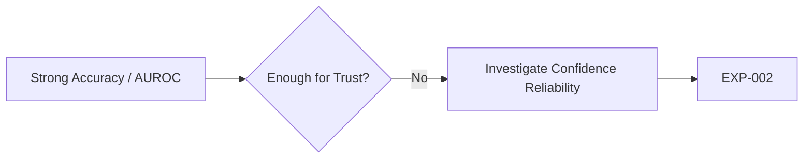

This observation created the motivation for probability-calibration analysis.

---

# 6. EXP-002 — Calibration Layer

EXP-002 investigated whether model probabilities reliably represented confidence.

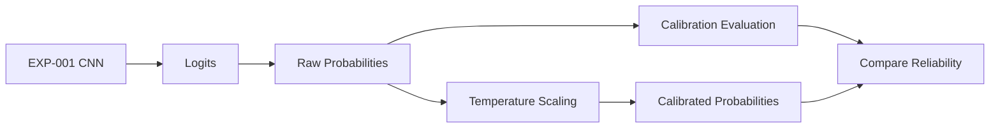

Temperature scaling was fitted on the validation set.

Verified fitting result:

```text
Temperature = 1.007948

Validation NLL
Before: 0.097432
After:  0.097427
```

The observed improvement was negligible under the evaluated experimental conditions.

This result motivates a more prediction-specific question:

> Can uncertainty provide useful information about individual model failures?

That question leads to EXP-003.

---

# 7. EXP-003 — Uncertainty Engine

**Status: Next**

EXP-003 will investigate whether greater estimated uncertainty corresponds to a greater likelihood of prediction error.

The initial experimental architecture is:

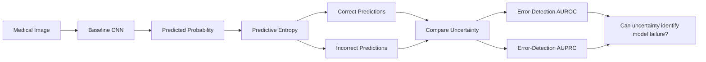

Predictive entropy will provide an initial deterministic uncertainty baseline.

An explicit uncertainty-aware approach may subsequently be compared against this baseline.

Possible methods include:

- MC Dropout; or
- Deep Ensembles.

The final method will be selected based on experimental justification rather than convenience alone.

---

# 8. Selective Prediction and Referral

If EXP-003 demonstrates that uncertainty contains useful information about prediction failure, EXP-004 will investigate whether that information can support selective prediction.

The conceptual architecture is:

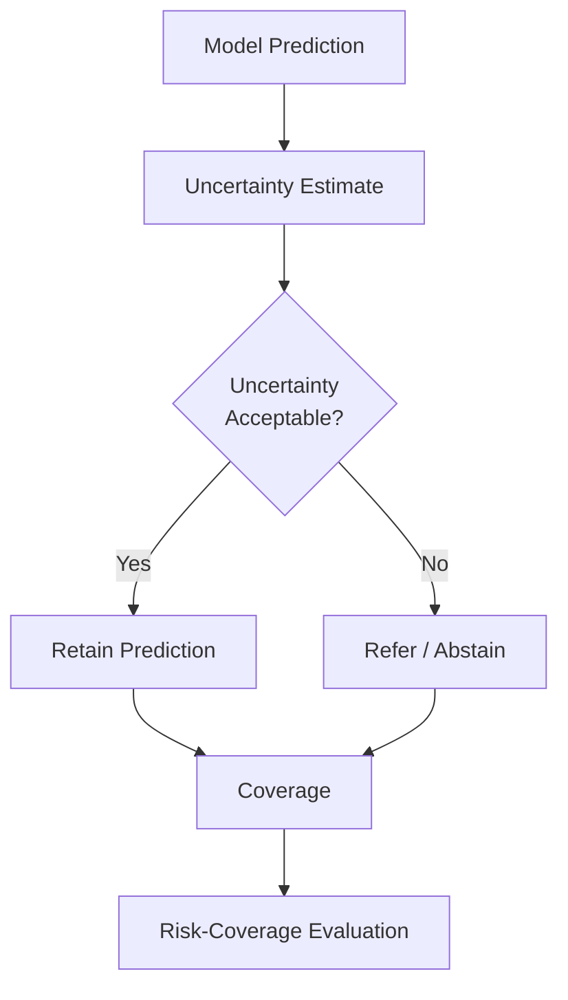

The objective is not simply to reject difficult cases.

The research question is whether uncertainty-based referral can reduce error among retained predictions while maintaining meaningful coverage.

Threshold decisions must be based on validation data rather than tuned on the held-out test set.

---

# 9. Distribution Shift

Healthcare models may encounter data that differs from their training distribution.

EXP-005 will investigate this problem.

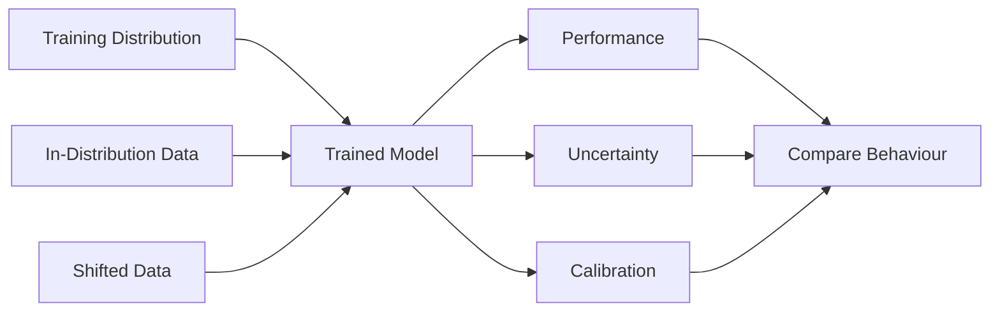

Important questions include:

- Does predictive performance deteriorate?
- Does calibration deteriorate?
- Does uncertainty increase?
- Can uncertainty identify unreliable shifted cases?

A trustworthy uncertainty mechanism should ideally become informative when the model encounters unfamiliar conditions.

---

# 10. Robustness Evaluation

EXP-006 will investigate model behaviour under controlled perturbations.

Conceptually:

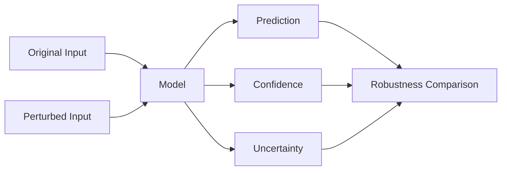

Potential perturbations may include controlled changes to image characteristics where scientifically justified.

The exact perturbation protocol will be defined before the experiment.

---

# 11. Multimodal Healthcare AI

The longer-term architecture extends beyond image-only classification.

Healthcare information naturally exists across multiple modalities.

Potential research inputs include:

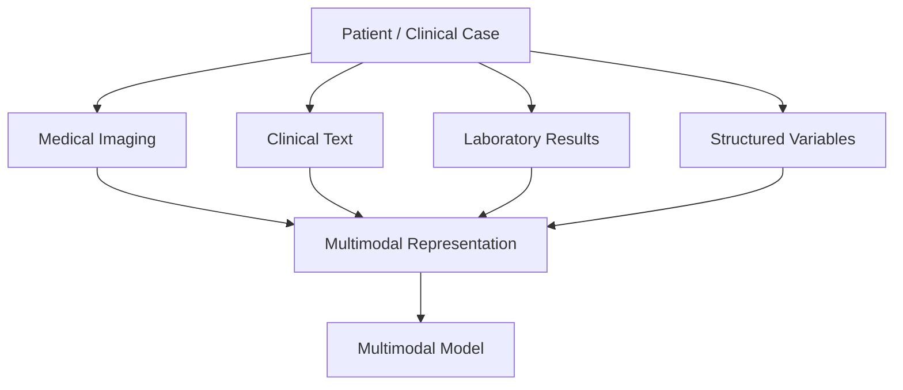

Examples may include:

### Imaging

- radiographs;
- CT;
- MRI; or
- other clinically relevant imaging modalities.

### Clinical text

- clinical notes;
- radiology reports;
- medical histories; or
- other textual clinical context.

### Structured information

- age;
- laboratory measurements;
- physiological observations;
- coded variables; or
- other tabular features.

The exact modalities used in future experiments will depend on suitable datasets and research questions.

---

# 12. Multimodal Fusion

Different modalities require modality-appropriate representations.

The target conceptual design is:

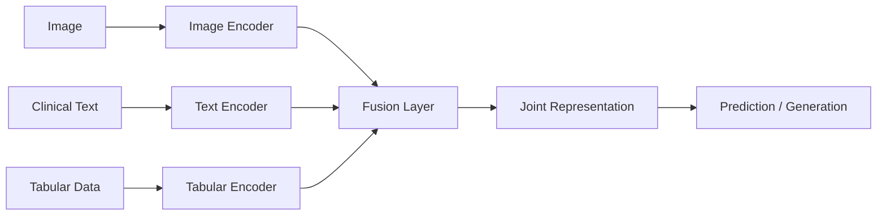

Future research may compare different fusion strategies rather than assuming one approach is optimal.

Possible research directions include:

- early fusion;
- intermediate fusion;
- late fusion;
- cross-attention; and
- vision-language architectures.

These remain future research directions and are not current repository capabilities.

---

# 13. Trustworthy Generative and Vision-Language AI

The later research programme may investigate models capable of combining medical images with textual context and generating clinically relevant research outputs.

Conceptually:

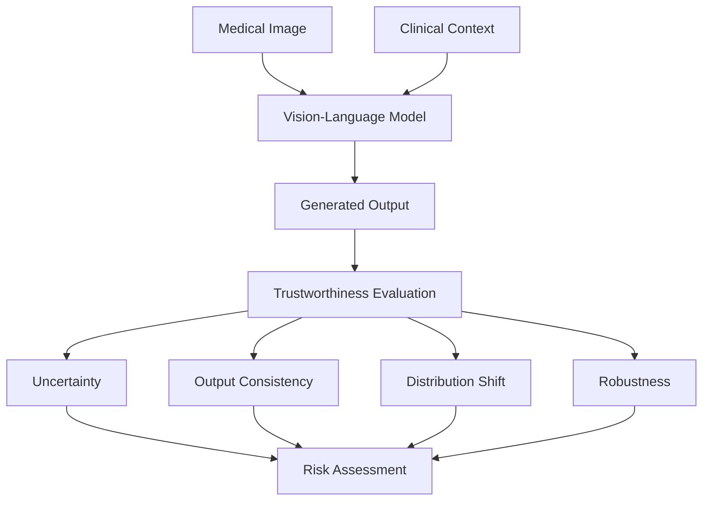

At this stage, new research questions emerge.

For example:

- Does generated text correspond to the available evidence?
- Does the model invent unsupported findings?
- Can uncertainty identify unreliable generations?
- What happens under distribution shift?
- Does multimodal context improve reliability?
- Can high-risk outputs be detected before presentation?

These questions connect predictive trustworthiness research with trustworthy generative AI.

---

# 14. Trustworthiness Layer

The long-term system separates model output from reliability assessment.

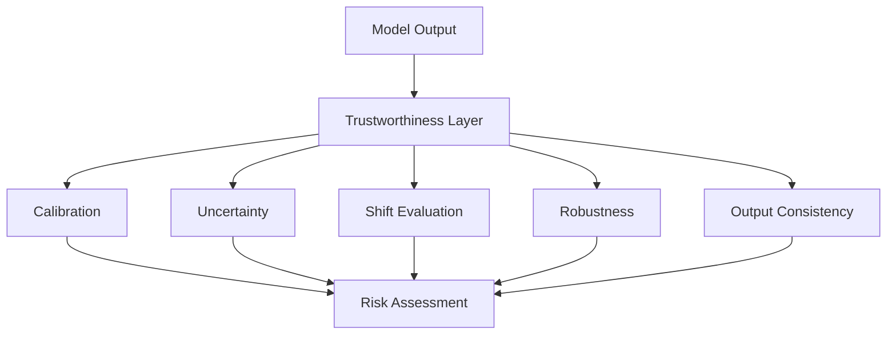

This separation is important.

The model producing an answer should not automatically imply that the answer is reliable.

---

# 15. Risk and Referral Layer

A future research prototype may use reliability signals to determine whether an output should be presented normally or flagged for review.

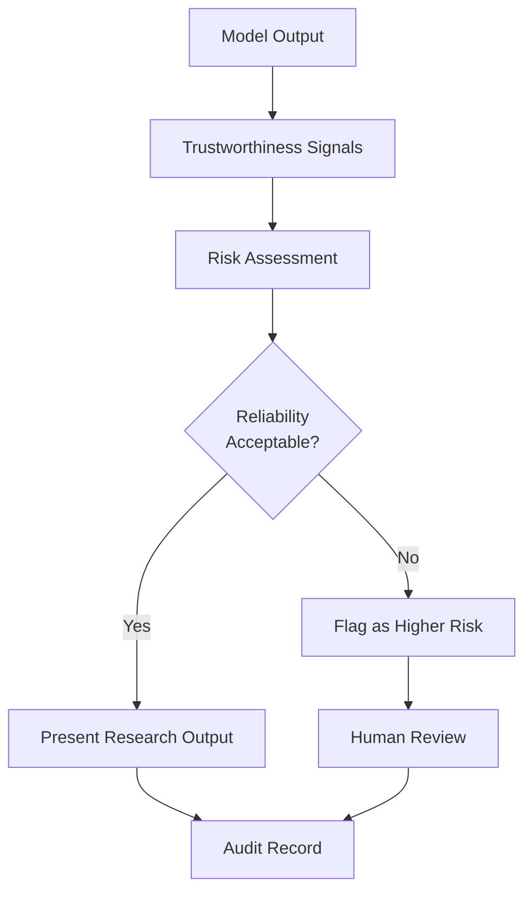

This architecture supports **human oversight** rather than autonomous clinical decision-making.

---

# 16. Research Interface

The final prototype may expose the integrated pipeline through a research-oriented interface.

A possible interaction flow is:

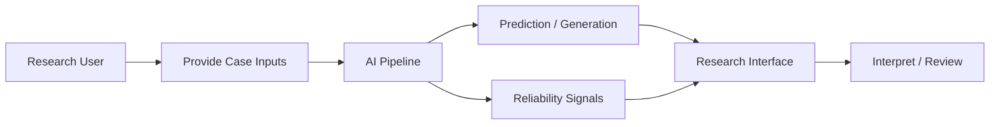

A future interface might present:

- model output;
- predicted probability;
- uncertainty estimate;
- reliability indicators;
- distribution-shift information;
- referral status; and
- experimental metadata.

The interface should expose uncertainty rather than hiding it.

---

# 17. Audit and Monitoring

Trustworthy systems require traceability.

The target research architecture therefore includes an audit path.

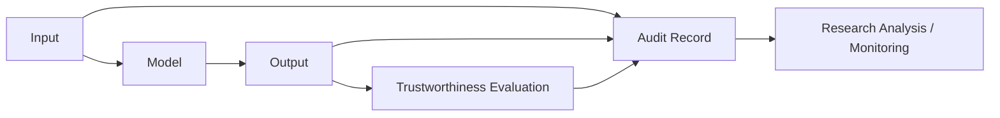

Potential recorded information may include:

- model version;
- experiment version;
- input condition;
- predicted output;
- confidence;
- uncertainty;
- shift condition;
- referral decision; and
- evaluation metadata.

No personally identifiable clinical information is required for the current benchmark experiments.

---

# 18. Software Architecture Direction

As the research matures, notebook-based experiments should progressively become reusable components.

Target progression:

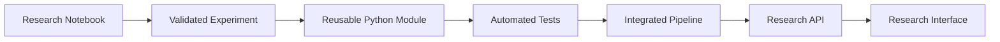

This prevents premature engineering while ensuring successful research components can later become part of a complete system.

---

# 19. Repository-to-System Mapping

The repository structure reflects this progression.

```text
trustworthy-healthcare-ai/
│
├── notebooks/
│   └── exploratory and controlled research experiments
│
├── src/
│   ├── data/
│   │   └── reusable data-processing components
│   │
│   ├── models/
│   │   └── predictive and future multimodal models
│   │
│   ├── evaluation/
│   │   └── metrics and evaluation utilities
│   │
│   └── uncertainty/
│       └── uncertainty-estimation components
│
├── experiments/
│   └── experiment configurations and supporting assets
│
├── results/
│   ├── figures/
│   ├── tables/
│   └── models/
│
├── docs/
│   └── research methodology, evidence, architecture, and reports
│
└── tests/
    └── reusable component verification
```

The structure may evolve as the research system grows.

---

# 20. Research and Engineering Boundary

A central design principle is maintaining a clear boundary between experimental evidence and engineering claims.

```mermaid
flowchart LR

    IDEA["Research Idea"] --> EXP["Experiment"]
    EXP --> RESULT["Result"]

    RESULT --> DEC{"Evidence<br/>Supports Use?"}

    DEC -->|"Yes"| COMPONENT["Reusable Component"]
    DEC -->|"No / Unclear"| RESEARCH["Further Research"]

    COMPONENT --> SYSTEM["Integrated System"]
    RESEARCH --> EXP
```

A negative result remains scientifically useful.

It should not be hidden simply because it prevents a planned component from being integrated.

---

# 21. Reproducibility Architecture

System development must preserve the relationship between code and evidence.

```mermaid
flowchart LR

    RQ["Research Question"] --> CODE["Code"]
    CODE --> ENV["Environment"]
    ENV --> DATA["Dataset"]
    DATA --> MODEL["Model"]
    MODEL --> EVAL["Evaluation"]
    EVAL --> ART["Artifacts"]
    ART --> DOC["Interpretation"]
```

Relevant repository mechanisms include:

- `pyproject.toml`;
- `uv.lock`;
- `.python-version`;
- fixed dataset splits;
- experiment-specific notebooks;
- saved model checkpoints;
- results tables;
- figures;
- experiment reports; and
- Git commit history.

---

# 22. Testing Strategy

As experimental code becomes reusable system code, testing becomes increasingly important.

The future testing hierarchy is:

```mermaid
flowchart TD

    UNIT["Unit Tests"]
    INT["Integration Tests"]
    MODEL["Model Behaviour Tests"]
    DATA["Data Validation"]
    REPRO["Reproducibility Checks"]

    UNIT --> QUALITY["Research Software Quality"]
    INT --> QUALITY
    MODEL --> QUALITY
    DATA --> QUALITY
    REPRO --> QUALITY
```

Testing requirements will grow alongside system complexity.

---

# 23. Security and Privacy Boundary

The current experiments use benchmark research datasets.

Future multimodal healthcare research would require stronger controls if real clinical information were ever introduced.

Potential considerations include:

- data minimisation;
- access control;
- de-identification;
- secure storage;
- auditability;
- model privacy;
- data provenance; and
- appropriate governance.

These controls are architectural considerations rather than claims about the current benchmark implementation.

---

# 24. Complete Target Research System

The eventual research prototype can be summarised as:

```mermaid
flowchart TD

    CASE["Healthcare Research Case"]

    CASE --> IMG["Medical Image"]
    CASE --> TXT["Clinical Text"]
    CASE --> TAB["Structured Clinical Data"]

    IMG --> IE["Image Encoder"]
    TXT --> TE["Text Encoder"]
    TAB --> TBE["Tabular Encoder"]

    IE --> FUSION["Multimodal Fusion"]
    TE --> FUSION
    TBE --> FUSION

    FUSION --> AI["Multimodal / Generative AI"]

    AI --> OUT["Prediction / Generated Output"]

    OUT --> TRUST["Trustworthiness Layer"]

    TRUST --> CAL["Calibration"]
    TRUST --> UQ["Uncertainty"]
    TRUST --> SHIFT["Shift"]
    TRUST --> ROB["Robustness"]
    TRUST --> CONS["Consistency"]

    CAL --> RISK["Risk Assessment"]
    UQ --> RISK
    SHIFT --> RISK
    ROB --> RISK
    CONS --> RISK

    RISK --> DEC{"Reliability<br/>Assessment"}

    DEC -->|"Lower Risk"| PRESENT["Research Output"]
    DEC -->|"Higher Risk"| REFER["Flag for Review"]

    REFER --> HUMAN["Human Review"]

    PRESENT --> UI["Research Interface"]
    HUMAN --> UI

    UI --> AUDIT["Audit / Monitoring"]
```

This represents the intended integration of the research programme.

It is not a claim that all components currently exist.

---

# 25. Current Position

The architecture currently stands here:

```mermaid
flowchart LR

    E1["EXP-001<br/>Prediction<br/>✅"] --> E2["EXP-002<br/>Calibration<br/>✅"]

    E2 --> E3["EXP-003<br/>Uncertainty<br/>🔬"]

    E3 --> E4["EXP-004<br/>Selective Prediction"]
    E4 --> E5["EXP-005<br/>Distribution Shift"]
    E5 --> E6["EXP-006<br/>Robustness"]

    E6 --> MM["Multimodal AI"]
    MM --> GEN["Generative / VLM"]
    GEN --> SYS["Integrated Prototype"]
```

The immediate architectural priority is therefore not to build the entire interface.

It is to determine whether an **uncertainty engine deserves to become part of the system**.

That requires EXP-003.

---

# 26. Architectural Principle

The project follows one overarching rule:

> **Do not integrate a research capability merely because it is technically possible. Integrate it when experimental evidence demonstrates what it contributes, where it fails, and how it should be interpreted.**

This allows the final system architecture to become a record of the research evidence rather than simply a software design diagram.

---

## Current Architecture Status

**Implemented**

- medical-image benchmark pipeline;
- baseline CNN;
- predictive evaluation;
- calibration evaluation; and
- temperature-scaling experiment.

**Next**

- uncertainty quantification;
- prediction-error detection; and
- uncertainty analysis.

**Planned**

- selective prediction;
- distribution-shift evaluation;
- robustness evaluation;
- multimodal modelling;
- trustworthy generative / vision-language AI; and
- integrated research prototype.

---

**Last architectural milestone:** EXP-002 — Probability Calibration  
**Current research milestone:** EXP-003 — Uncertainty Quantification and Error Detection
