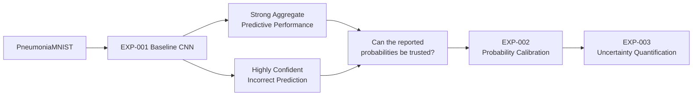
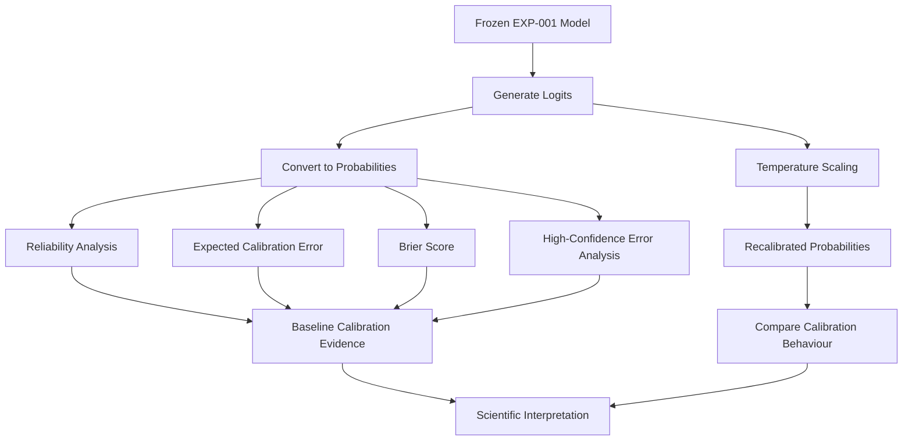
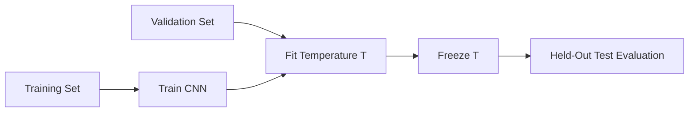
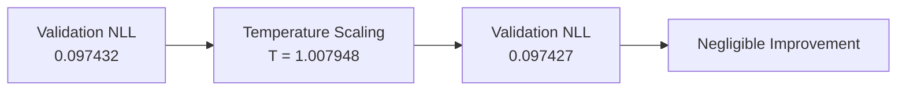
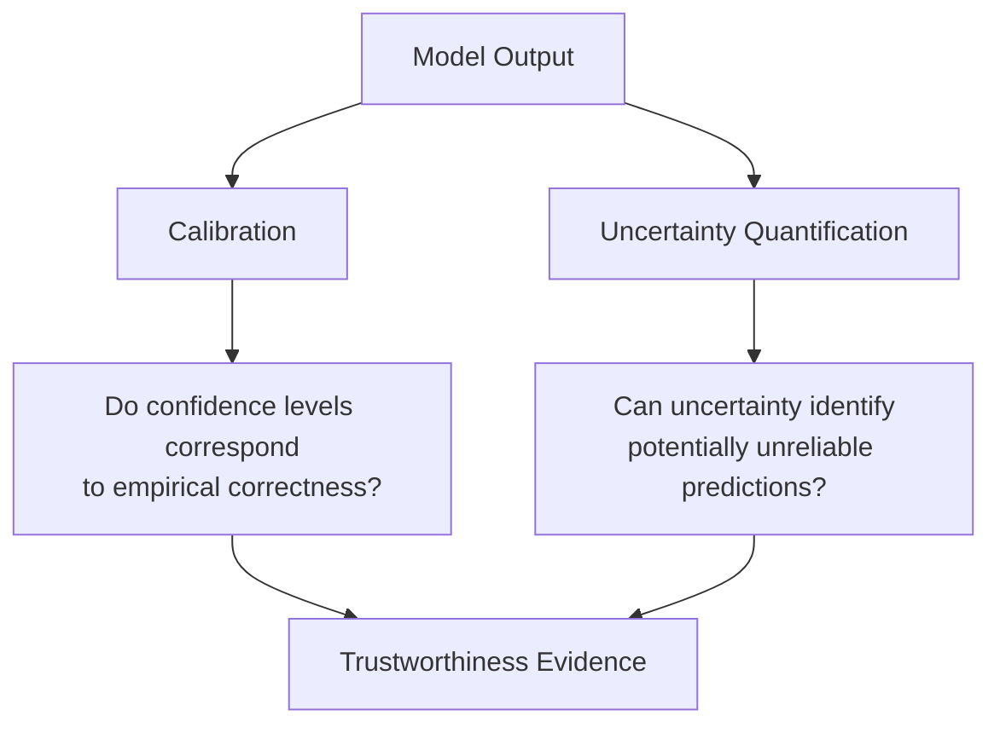
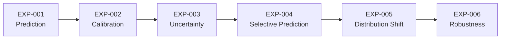
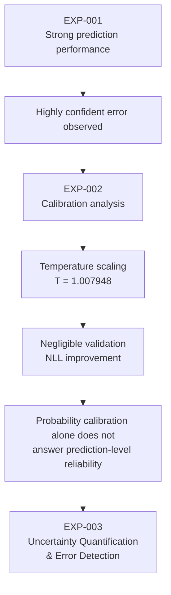
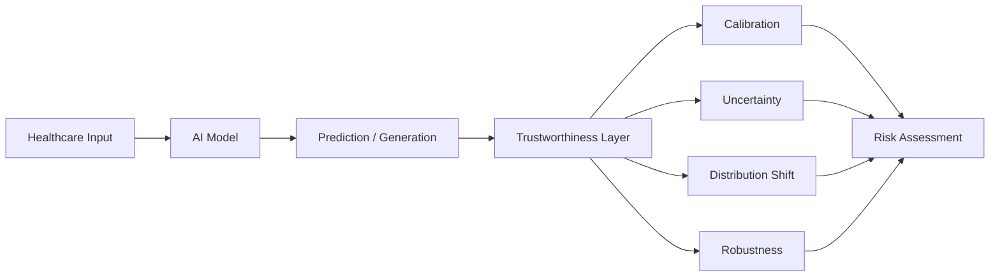

# EXP-002 — Probability Calibration

**Project:** Trustworthy Healthcare AI  
**Experiment:** EXP-002  
**Research Stage:** Probability Calibration  
**Status:** Complete  
**Predecessor:** EXP-001 — Baseline Medical Image Classification  
**Successor:** EXP-003 — Uncertainty Quantification and Error Detection  

---

## 1. Experiment Overview

EXP-002 investigates whether the probability estimates produced by the baseline medical-image classifier can be interpreted as reliable measures of predictive confidence.

EXP-001 demonstrated that the baseline CNN achieved strong aggregate classification performance on PneumoniaMNIST. However, error analysis also revealed an important trustworthiness problem: the model could make an incorrect prediction while assigning extremely high probability to that prediction.

This observation motivated a transition from evaluating only:

```text
Is the prediction correct?
```

to investigating:

```text
Does the reported probability accurately represent confidence?
```

EXP-002 therefore focuses on **probability calibration**.

The experiment evaluates the baseline model's probability behaviour and investigates whether post-hoc temperature scaling improves probability calibration without retraining the classifier.

---

## 2. Research Motivation

High predictive accuracy alone is insufficient for trustworthy healthcare AI.

Consider two predictions:

```text
Prediction A
P(pneumonia) = 0.60

Prediction B
P(pneumonia) = 0.99
```

Both may produce the same binary class prediction at a threshold of 0.5.

However, their probability values communicate very different levels of confidence.

For probability estimates to be useful in reliability-sensitive systems, confidence should meaningfully correspond to empirical correctness.

A model that frequently produces extremely confident incorrect predictions may create risk even when its overall classification metrics appear strong.

---

## 3. Research Question

> **How well calibrated are the probability estimates produced by the baseline CNN for pneumonia classification, and does the model exhibit overconfidence when making incorrect predictions?**

A secondary methodological question is:

> **Can post-hoc temperature scaling improve the probability calibration of the existing model without changing the underlying classifier?**

---

## 4. Relationship to EXP-001

EXP-001 established the predictive baseline.

The held-out test performance was:

| Metric | Result |
|---|---:|
| Accuracy | 0.884615 |
| AUROC | 0.936993 |
| Sensitivity | 0.9846 |
| Specificity | 0.7179 |
| Precision | 0.8533 |
| F1-score | 0.914286 |

These results demonstrated useful discrimination on the benchmark.

However, EXP-001 also identified an incorrectly classified normal image receiving approximately:

```text
P(pneumonia) ≈ 0.9998
```

This represents a highly confident error.

That observation provides the direct motivation for EXP-002.

---

## 5. Research Progression



The transition from EXP-001 to EXP-002 is therefore evidence-driven rather than arbitrary.

---

## 6. Dataset

EXP-002 uses the same PneumoniaMNIST benchmark and predefined dataset splits used in EXP-001.

| Split | Samples | Purpose |
|---|---:|---|
| Training | 4,708 | Original model training |
| Validation | 524 | Temperature fitting |
| Test | 624 | Held-out evaluation |
| **Total** | **5,856** | |

No resampling was introduced for the calibration experiment.

The original dataset split structure was preserved.

---

## 7. Model

EXP-002 reuses the trained CNN from EXP-001.

Conceptually:


The baseline model itself is not retrained as part of the initial calibration analysis.

This is important because EXP-002 is designed to investigate the probability behaviour of the existing predictive model rather than introduce a new classifier.

---

## 8. Why Calibration Is Different From Accuracy

Accuracy answers:

> How often is the predicted class correct?

Calibration asks:

> When the model reports a given confidence level, how well does that confidence correspond to observed correctness?

A model can therefore have:

```text
High Accuracy
     +
Poor Calibration
```

or:

```text
Moderate Accuracy
     +
Reasonable Calibration
```

These are related but distinct properties.

---

## 9. Why Calibration Is Different From Discrimination

AUROC evaluates how effectively model scores rank positive examples above negative examples.

Calibration evaluates the numerical reliability of the predicted probabilities.

Consequently:

```text
Discrimination
     ↓
Can the model rank cases?

Calibration
     ↓
Can the probability values themselves be interpreted reliably?
```

A calibration method should therefore not be expected to improve discrimination automatically.

---

## 10. Calibration Evaluation Strategy

EXP-002 investigates calibration using complementary approaches.

The evaluation framework includes:

- reliability analysis;
- Expected Calibration Error (ECE);
- Brier score;
- confidence behaviour;
- high-confidence errors; and
- post-hoc temperature scaling.

No single calibration metric is treated as sufficient by itself.

---

## 11. Reliability Diagram

A reliability diagram compares predicted confidence with empirical correctness.

Conceptually:

```text
Predicted Confidence
        ↓
Group predictions into bins
        ↓
Observed Accuracy per bin
        ↓
Compare confidence with accuracy
```

A perfectly calibrated model would approximately follow:

```text
Confidence ≈ Empirical Accuracy
```

For example:

```text
Predictions with confidence ≈ 0.80
                ↓
Should be correct approximately 80% of the time
```

Systematic departures from this relationship indicate calibration error.

---

## 12. Expected Calibration Error

Expected Calibration Error summarises differences between confidence and empirical accuracy across confidence bins.

Conceptually:

\[
ECE = \sum_{m=1}^{M}
\frac{|B_m|}{n}
\left|
acc(B_m)-conf(B_m)
\right|
\]

where:

- \(B_m\) is calibration bin \(m\);
- \(acc(B_m)\) is empirical accuracy in that bin;
- \(conf(B_m)\) is average confidence in that bin; and
- \(n\) is the total number of predictions.

Lower ECE generally indicates closer agreement between confidence and observed correctness under the chosen binning scheme.

However, ECE depends on binning choices and should not be interpreted as a complete description of calibration.

---

## 13. Brier Score

The Brier score evaluates squared error between predicted probabilities and observed binary outcomes.

For binary classification:

\[
BS = \frac{1}{N}\sum_{i=1}^{N}(p_i-y_i)^2
\]

where:

- \(p_i\) is the predicted probability;
- \(y_i\) is the observed binary outcome; and
- \(N\) is the number of observations.

Lower values indicate smaller probability error.

Unlike accuracy, the Brier score evaluates the quality of probability estimates rather than only thresholded class predictions.

---

## 14. High-Confidence Error Analysis

EXP-002 also examines predictions that are:

```text
Incorrect
    +
High Confidence
```

For binary prediction, confidence can be represented as:

\[
confidence = \max(p,1-p)
\]

A high-confidence error therefore represents a case where the model is not merely wrong but strongly committed to the incorrect prediction.

This is especially relevant to trustworthy AI because confidence may influence downstream reliance on model outputs.

---

## 15. Calibration Analysis Flow



---

## 16. Temperature Scaling

Temperature scaling is a post-hoc calibration technique.

Given a model logit \(z\), the calibrated probability is obtained from:

\[
p = \sigma\left(\frac{z}{T}\right)
\]

where:

- \(z\) is the original model logit;
- \(T\) is a learned positive scalar temperature; and
- \(\sigma\) is the sigmoid function.

The model weights remain unchanged.

Only the scale of the logits is adjusted.

---

## 17. Interpretation of Temperature

Conceptually:

```text
T > 1
    ↓
Logits become less extreme
    ↓
Probabilities generally become softer


T < 1
    ↓
Logits become more extreme
    ↓
Probabilities generally become sharper


T ≈ 1
    ↓
Very little change to original logits
```

The fitted temperature therefore provides useful information about the magnitude of the global calibration adjustment identified on validation data.

---

## 18. Why Temperature Is Fitted on Validation Data

Temperature is a learned calibration parameter.

It must therefore not be fitted using the held-out test set.

The correct experimental structure is:



This protects the test set from becoming part of the calibration-fitting procedure.

---

## 19. Positive Temperature Constraint

Temperature must remain positive.

The implementation therefore optimises a log-temperature parameter and transforms it back into temperature space.

Conceptually:

\[
T = \exp(\theta)
\]

This guarantees:

\[
T > 0
\]

during optimisation.

---

## 20. Optimisation

Temperature fitting uses validation negative log-likelihood as the optimisation objective.

The purpose is to identify a scalar temperature that improves the probabilistic fit of the existing model outputs on validation data.

The corrected optimisation procedure produced the final verified temperature:

\[
T = 1.007948
\]

This value is extremely close to 1.

---

## 21. Verified Temperature-Fitting Result

The final verified validation result was:

| Stage | Validation NLL |
|---|---:|
| Before temperature scaling | 0.097432 |
| After temperature scaling | 0.097427 |

The absolute reduction was:

\[
0.097432 - 0.097427 = 0.000005
\]

Therefore, the observed improvement in validation negative log-likelihood was negligible.

---

## 22. Result Visualisation



The result does not support a claim of substantial calibration improvement from global temperature scaling in this experimental setting.

---

## 23. Scientific Interpretation

The fitted temperature:

```text
T = 1.007948
```

is very close to the identity transformation:

```text
T = 1
```

Similarly, validation NLL changed only from:

```text
0.097432
```

to:

```text
0.097427
```

This indicates that global temperature scaling made only a very small adjustment to the model's logits under the evaluated validation conditions.

The appropriate conclusion is therefore:

> **Global temperature scaling produced negligible improvement in validation negative log-likelihood for this model and experimental setting.**

This conclusion is deliberately narrow.

---

## 24. What This Result Does Not Mean

The experiment does **not** demonstrate that:

- temperature scaling is generally ineffective;
- temperature scaling does not work for medical AI;
- the model is perfectly calibrated;
- calibration is unnecessary;
- high-confidence errors have been solved;
- the model is clinically trustworthy; or
- probability calibration and uncertainty quantification are equivalent.

The result applies to the model, dataset and experimental procedure evaluated here.

---

## 25. Important Evidence-Provenance Note

An earlier preliminary temperature-scaling run produced additional before/after test-set values.

However, the temperature-optimisation procedure was subsequently corrected.

The final corrected temperature is:

```text
T = 1.007948
```

with verified validation NLL:

```text
0.097432 → 0.097427
```

Exact corrected post-scaling test calibration metrics are therefore **not reported here unless they are independently confirmed from the final corrected evaluation artifact**.

This prevents preliminary results from being presented as final experimental evidence.

---

## 26. Why Class Predictions Are Not the Main Objective

Temperature scaling with positive \(T\) rescales logits but does not change their sign.

For binary classification at the standard 0.5 probability threshold:

```text
z > 0
    ↓
p > 0.5

z < 0
    ↓
p < 0.5
```

and for positive temperature:

```text
sign(z / T) = sign(z)
```

Therefore temperature scaling is intended primarily to alter probability calibration rather than thresholded class decisions.

Its purpose is not to increase classification accuracy directly.

---

## 27. Why AUROC Is Not the Main Objective

Positive temperature scaling is monotonic with respect to the original logits.

It therefore preserves score ordering.

Since AUROC depends on ranking rather than the absolute probability scale, substantial discrimination changes are not the expected objective of temperature scaling.

The primary question is probability reliability.

---

## 28. The Remaining Trustworthiness Problem

Even after calibration analysis, an important problem remains:

```text
Model produces probability
          ↓
Probability may appear decisive
          ↓
But is the model actually uncertain about the case?
```

Calibration operates primarily at the level of population probability reliability.

It does not automatically provide a complete prediction-level uncertainty estimate.

This distinction motivates EXP-003.

---

## 29. Calibration vs Uncertainty Quantification



Calibration and uncertainty quantification are complementary rather than interchangeable.

---

## 30. Why Predictive Entropy Comes Next

EXP-003 begins by investigating deterministic predictive entropy.

For binary probability \(p\):

\[
H(p)=-p\log(p)-(1-p)\log(1-p)
\]

The key research question will not simply be whether entropy can be calculated.

Instead:

> **Does greater estimated uncertainty correspond to greater likelihood of model error?**

This directly extends the reliability question exposed by EXP-001 and EXP-002.

---

## 31. Research Progression After EXP-002



Each experiment addresses a distinct trustworthiness question.

---

## 32. Capability Progression

From a system perspective:

```text
EXP-001
    ↓
Prediction Engine

EXP-002
    ↓
Calibration Evaluation Layer

EXP-003
    ↓
Candidate Uncertainty Engine

EXP-004
    ↓
Selective Prediction / Referral

EXP-005
    ↓
Distribution-Shift Evaluation

EXP-006
    ↓
Robustness Evaluation
```

A component becomes part of the final research prototype only when supported by experimental evidence and clearly documented limitations.

---

## 33. Reproducibility

EXP-002 is tied to the same research environment used by the broader project.

Core environment:

```text
Python 3.11
uv
PyTorch
torchvision
NumPy
pandas
scikit-learn
matplotlib
MedMNIST
```

The calibration experiment should remain traceable to:

- the EXP-001 model architecture;
- the EXP-001 checkpoint;
- PneumoniaMNIST;
- predefined train/validation/test splits;
- the temperature-scaling implementation;
- the validation fitting procedure;
- the final fitted temperature; and
- saved calibration artifacts.

---

## 34. Experiment Integrity

The following principles govern interpretation of EXP-002:

1. Temperature fitting uses validation data rather than test data.
2. The existing classifier is not retrained for post-hoc calibration.
3. Preliminary results are not substituted for corrected final evidence.
4. Negligible results are reported rather than hidden.
5. Calibration is not equated with uncertainty quantification.
6. Benchmark evidence is not presented as clinical validation.
7. Conclusions remain limited to the evaluated experimental setting.

---

## 35. Limitations

EXP-002 has several important limitations.

### Single dataset

The experiment evaluates PneumoniaMNIST only.

Calibration behaviour may differ across datasets, institutions, populations and imaging conditions.

### Single model

The calibration result concerns the baseline CNN used in this project.

Different architectures may exhibit different probability behaviour.

### Global calibration method

Temperature scaling learns a single scalar parameter.

This may be insufficient for more complex forms of calibration error.

### Benchmark setting

PneumoniaMNIST is useful for controlled research but does not reproduce the full complexity of clinical deployment.

### No distribution-shift evaluation

EXP-002 does not establish whether calibration remains stable when the data distribution changes.

### No complete epistemic uncertainty estimate

Probability calibration does not quantify all sources of model uncertainty.

### No clinical validation

The experiment does not demonstrate safety, diagnostic reliability or clinical readiness.

---

## 36. Main Finding

The principal verified finding from EXP-002 is:

> **Validation-fitted global temperature scaling produced a temperature of 1.007948 and changed validation NLL only from 0.097432 to 0.097427, indicating negligible improvement under the evaluated conditions.**

This is a valid negative/negligible result.

It provides evidence that simply applying a global probability rescaling is not sufficient to resolve the broader trustworthiness questions exposed by the baseline model.

---

## 37. Research Implication

The result shifts the next research question from:

```text
Can we globally rescale model confidence?
```

toward:

```text
Can uncertainty estimates identify predictions
that are more likely to be wrong?
```

This motivates EXP-003.

---

## 38. Connection to EXP-003



EXP-003 will investigate whether uncertainty estimates contain useful information about model failure.

---

## 39. Experiment Artifacts

Primary experimental implementation:

```text
notebooks/02_confidence_calibration.ipynb
```

Related baseline model:

```text
results/models/experiment_001_baseline_cnn.pt
```

Expected calibration artifacts include calibration tables and reliability visualisations.

Only artifacts that are confirmed to exist in the repository should be treated as final saved evidence.

---

## 40. Relationship to the Final System

The long-term research system is intended to contain multiple trustworthiness mechanisms:



EXP-002 contributes evidence toward the **calibration component** of this architecture.

It does not independently establish the reliability of the complete system.

---

## 41. Experiment Status

| Component | Status |
|---|---|
| Baseline model reused | Complete |
| Calibration analysis | Complete |
| Temperature scaling | Complete |
| Validation fitting | Complete |
| Corrected temperature verified | Complete |
| Corrected validation NLL verified | Complete |
| Broader uncertainty evaluation | Not part of EXP-002 |
| Distribution-shift calibration | Future work |
| Clinical validation | Not performed |

---

## 42. Final Conclusion

EXP-002 examined probability calibration as the second stage of the Trustworthy Healthcare AI research programme.

The experiment was motivated by a key observation from EXP-001: strong aggregate classification performance can coexist with highly confident individual errors.

Post-hoc temperature scaling was fitted using validation data while preserving the underlying classifier.

The corrected procedure produced:

```text
Temperature: 1.007948

Validation NLL:
0.097432 → 0.097427
```

The improvement was negligible.

This result should not be interpreted as evidence that calibration is unimportant or that temperature scaling is generally ineffective.

Instead, it demonstrates that **global temperature rescaling provided little additional benefit in this specific experimental setting**.

More importantly, calibration alone does not answer whether prediction-level uncertainty can identify unreliable outputs.

That unresolved question provides the direct scientific motivation for:

> **EXP-003 — Uncertainty Quantification and Error Detection**

---

**Experiment Status:** Complete  
**Primary Verified Calibration Result:** Negligible validation NLL improvement after temperature scaling  
**Next Experiment:** EXP-003 — Uncertainty Quantification and Error Detection
