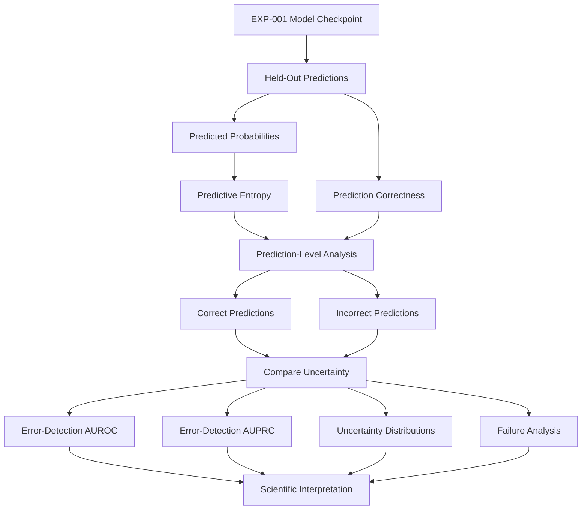
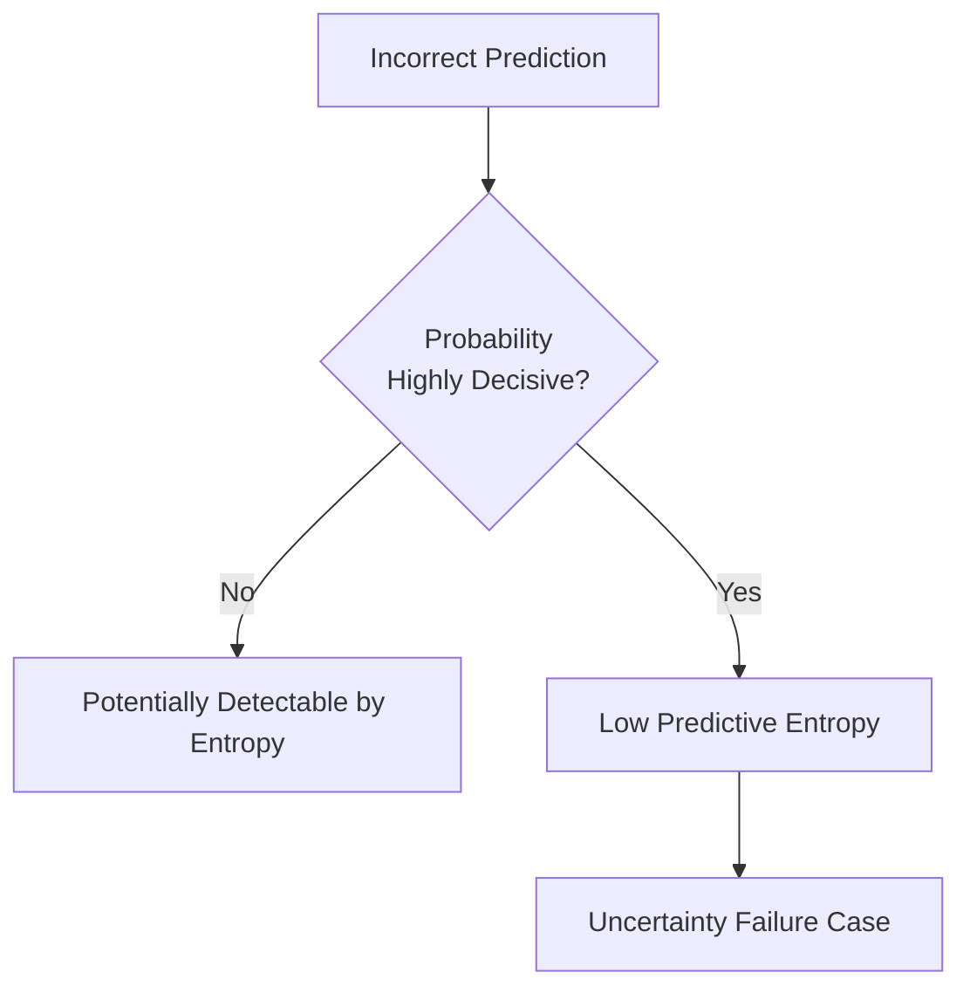
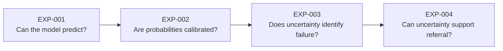
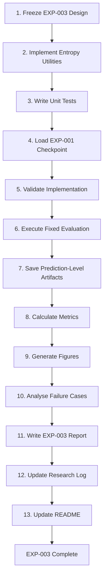
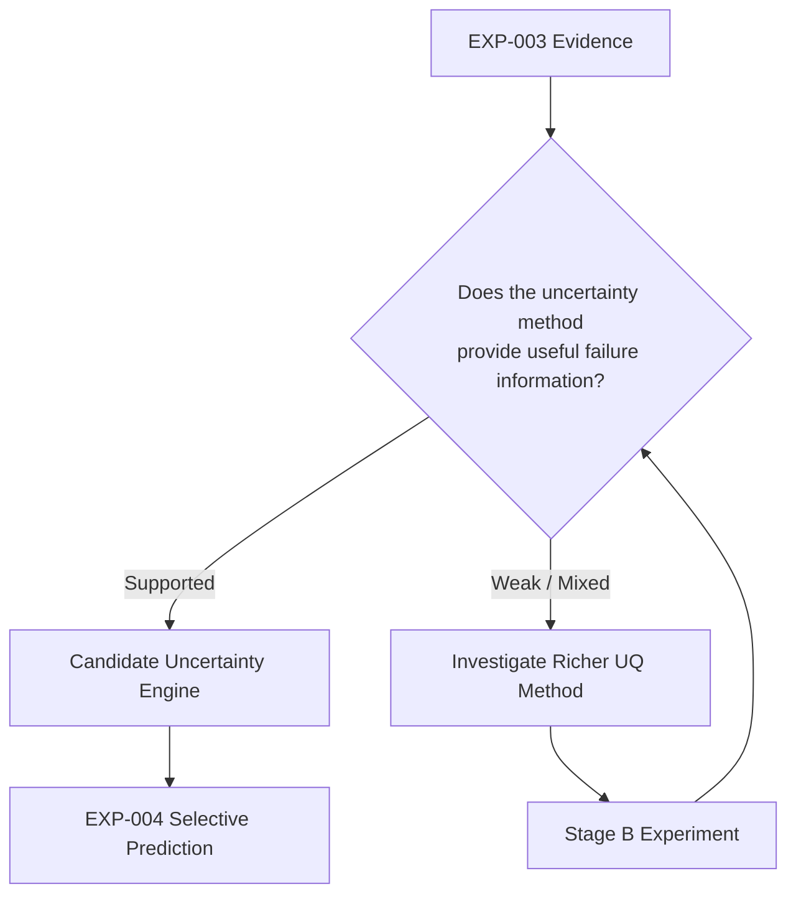
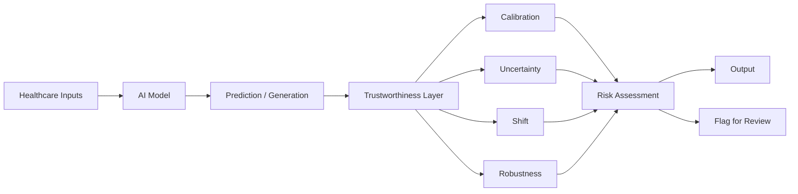

# EXP-003 — Uncertainty Quantification and Error Detection

**Project:** Trustworthy Healthcare AI  
**Experiment:** EXP-003  
**Stage:** Uncertainty Quantification and Error Detection  
**Status:** Experimental Design — Pre-Execution  
**Predecessor:** EXP-002 — Probability Calibration  
**Successor:** EXP-004 — Selective Prediction and Referral  
**Results available at design time:** No EXP-003 results have been generated

---

# 1. Experiment Purpose

EXP-003 investigates whether prediction-level uncertainty provides useful information about model failure in the existing medical-image classification setting.

EXP-001 established that the baseline CNN can achieve strong predictive performance while still producing highly confident incorrect predictions.

EXP-002 subsequently investigated probability calibration and found that validation-fitted global temperature scaling produced negligible improvement under the evaluated experimental conditions.

These findings motivate a different question.

Rather than asking only:

> How confident is the model?

EXP-003 asks:

> **Does the model become more uncertain when it is more likely to be wrong?**

The distinction is important because confidence and useful uncertainty are not necessarily equivalent.

---

# 2. Primary Research Question

> **Does predictive uncertainty provide useful information for distinguishing incorrect from correct predictions produced by the baseline medical-image classifier?**

---

# 3. Secondary Research Questions

EXP-003 will additionally investigate:

1. Do incorrect predictions exhibit greater predictive entropy than correct predictions?

2. Can predictive entropy discriminate model errors from correct predictions?

3. Are some incorrect predictions associated with very low predictive entropy?

4. Does the high-confidence error behaviour observed during earlier experiments remain problematic when viewed through predictive entropy?

5. Is probability-derived predictive entropy sufficient as an uncertainty mechanism, or is a richer uncertainty-estimation method justified?

---

# 4. Pre-Experiment Hypothesis

The primary research hypothesis is:

> **H1:** Incorrect predictions will, on average, exhibit greater predictive uncertainty than correct predictions, allowing uncertainty to provide useful information about model error.

The competing possibility is:

> **H0 / competing outcome:** Probability-derived predictive entropy may provide weak discrimination between correct and incorrect predictions because highly confident incorrect predictions can also have low entropy.

Both outcomes are scientifically meaningful.

The experiment will not be modified simply to produce a favourable uncertainty result.

---

# 5. Evidence Motivating EXP-003

EXP-001 produced the following held-out test performance:

| Metric | Result |
|---|---:|
| Accuracy | 0.884615 |
| AUROC | 0.936993 |
| Sensitivity | 0.9846 |
| Specificity | 0.7179 |
| Precision | 0.8533 |
| F1-score | 0.914286 |

However, aggregate performance did not guarantee reliable individual predictions.

An incorrectly classified normal image was observed with approximately:

```text
P(pneumonia) ≈ 0.9998
```

This represents a highly confident model error.

EXP-002 then investigated probability calibration.

The final validation-fitted temperature was:

```text
T = 1.007948
```

Validation negative log-likelihood changed from:

```text
Before temperature scaling: 0.097432
After temperature scaling:  0.097427
```

The improvement was negligible under the evaluated conditions.

These observations motivate prediction-level uncertainty analysis.

---

# 6. Conceptual Distinction

EXP-003 distinguishes between:

```text
Prediction
    ↓
Probability
    ↓
Confidence
```

and:

```text
Prediction
    ↓
Uncertainty estimate
    ↓
Does uncertainty correspond to failure risk?
```

A probability close to 0 or 1 represents a decisive model output.

It does not automatically demonstrate that the model has correctly quantified all relevant forms of uncertainty.

---

# 7. Stage A — Deterministic Uncertainty Baseline

The first stage of EXP-003 will use **binary predictive entropy** derived from the existing EXP-001 probabilities.

No model retraining is required for Stage A.

For a predicted probability \(p\), binary predictive entropy is defined as:

\[
H(p) = -p\log(p) - (1-p)\log(1-p)
\]

where natural logarithms are used.

For binary classification:

```text
p ≈ 0.50
    ↓
Maximum predictive entropy
    ↓
Probability-level ambiguity is high
```

while:

```text
p → 0 or p → 1
    ↓
Low predictive entropy
    ↓
Probability-level decisiveness is high
```

The theoretical maximum is:

\[
H(0.5)=\ln(2)
\]

approximately:

```text
0.6931 nats
```

---

# 8. Interpretation Boundary

Predictive entropy derived from a single deterministic model will be treated as a:

> **deterministic probability-derived uncertainty baseline**

It will **not** be described as a complete estimate of epistemic uncertainty.

In particular, low entropy does not prove that a prediction is reliable.

A model can produce:

```text
Incorrect Prediction
        +
Extreme Probability
        ↓
Low Predictive Entropy
```

This is one of the behaviours EXP-003 is designed to investigate.

---

# 9. Existing Model Control

Stage A will use the existing EXP-001 baseline CNN checkpoint.

The model architecture and learned parameters will not be changed for the deterministic entropy baseline.

Conceptually:


This preserves continuity with EXP-001 and EXP-002.

---

# 10. Data Governance

The predefined PneumoniaMNIST dataset splits remain:

| Split | Samples | Purpose |
|---|---:|---|
| Training | 4,708 | Existing model training |
| Validation | 524 | Method decisions where required |
| Test | 624 | Held-out final evaluation |
| **Total** | **5,856** | |

The test set must not be used to choose:

- uncertainty thresholds;
- referral thresholds;
- preferred uncertainty methods;
- model hyperparameters;
- architecture changes; or
- stopping criteria.

---

# 11. Experimental Flow

The Stage A experiment will follow:



---

# 12. Unit of Analysis

The primary unit of analysis is an individual model prediction.

For every evaluated sample, the experiment should preserve at least:

```text
sample_id
true_label
predicted_probability
predicted_label
correct
predictive_entropy
normalized_predictive_entropy
```

Additional fields may be introduced if scientifically justified.

This prediction-level artifact allows later analyses to be reproduced without repeatedly rerunning inference.

---

# 13. Primary Uncertainty Measure

The primary Stage A uncertainty measure is:

```text
Binary Predictive Entropy
```

The experiment may also store normalized entropy:

\[
H_{norm}(p)=\frac{H(p)}{\ln(2)}
\]

giving an interpretable scale where the theoretical maximum is approximately 1.

Normalized entropy is a transformation of the same uncertainty quantity and is not an independent uncertainty method.

---

# 14. Correct-vs-Incorrect Analysis

Predictions will be divided into:

```text
Correct Predictions
        vs
Incorrect Predictions
```

Their uncertainty distributions will then be compared.

The primary descriptive question is:

> Do incorrect predictions tend to receive greater uncertainty than correct predictions?

Planned descriptive statistics include:

- number of observations;
- mean uncertainty;
- median uncertainty;
- standard deviation;
- interquartile range; and
- relevant quantiles.

Distribution visualisation will also be used.

---

# 15. Error Detection Formulation

For error-detection analysis, prediction correctness will be transformed into a binary target:

```text
Correct prediction   → 0
Incorrect prediction → 1
```

Predictive uncertainty will be treated as the error-detection score.

Therefore:

```text
Higher uncertainty
        ↓
Greater predicted likelihood of model failure
```

The experiment will test whether this ranking is informative.

---

# 16. Primary Error-Detection Metrics

The primary error-detection metrics will be:

## Error-Detection AUROC

This evaluates whether uncertainty tends to rank incorrect predictions above correct predictions.

Interpretation:

```text
AUROC ≈ 0.5
    ↓
Little ranking discrimination

Higher AUROC
    ↓
Errors tend to receive greater uncertainty
```

AUROC will not be interpreted in isolation.

---

## Error-Detection AUPRC

AUPRC will also be reported because prediction errors may represent a minority of evaluated cases.

The positive class will be:

```text
Incorrect Prediction
```

The underlying error prevalence must be reported alongside AUPRC.

This is necessary because the precision-recall baseline depends on the prevalence of the positive class.

---

# 17. Supporting Analysis

Supporting analyses may include:

- entropy distribution for correct predictions;
- entropy distribution for incorrect predictions;
- uncertainty histograms;
- uncertainty boxplots;
- uncertainty quantiles;
- highest-uncertainty predictions;
- lowest-uncertainty errors;
- high-confidence incorrect predictions; and
- individual failure examples where appropriate.

These analyses are exploratory supplements to the predefined primary evaluation.

---

# 18. High-Confidence / Low-Uncertainty Errors

A particularly important failure category is:

```text
Incorrect
    +
Highly confident
    +
Low predictive entropy
```

These cases will be examined explicitly.

Conceptually:



Such cases would demonstrate a limitation of probability-derived entropy as an error detector.

---

# 19. Expected Relationship With Previous Experiments

The research progression is:



EXP-003 therefore does not replace calibration analysis.

It investigates a different reliability property.

---

# 20. Stage B — Explicit Uncertainty Estimation

Stage B will be considered after the deterministic entropy baseline has been evaluated.

Potential methods include:

### MC Dropout

Advantages:

- computationally relatively inexpensive;
- commonly used approximate Bayesian uncertainty approach;
- multiple stochastic forward passes can provide prediction variability.

Important limitation:

The existing EXP-001 CNN contains no dropout layers.

Therefore MC Dropout cannot be correctly applied to the existing checkpoint without changing the architecture and retraining.

---

### Deep Ensembles

Advantages:

- conceptually straightforward;
- empirically strong uncertainty baseline;
- captures variation across independently trained models;
- suitable for comparison with deterministic entropy.

Costs:

- multiple models must be trained;
- increased compute;
- additional experiment-management requirements.

---

# 21. Stage B Selection Rule

The choice between an explicit uncertainty method will not be based solely on which method is easiest to implement.

Selection should consider:

- scientific relevance;
- computational feasibility;
- comparability;
- reproducibility;
- interpretability;
- expected contribution to the research question; and
- limitations introduced by architectural changes.

The decision and rationale must be documented before the selected Stage B experiment is executed.

---

# 22. Multiple-Seed Consideration

If Stage B requires model retraining, multiple random seeds should be considered.

This is particularly relevant for Deep Ensembles, where independently trained models are part of the uncertainty mechanism.

Results from retrained models should not be presented as directly identical to the original EXP-001 checkpoint.

Any comparison must clearly identify the models and training procedures involved.

---

# 23. Validation Governance

Validation data will be used for decisions that must be made before held-out evaluation.

Examples may include:

- uncertainty-method configuration;
- architecture decisions;
- model-selection decisions;
- threshold development for later selective prediction; and
- debugging methodological implementation.

The validation set may not be used to manufacture a favourable conclusion.

---

# 24. Test-Set Governance

The held-out test set is reserved for final evaluation after the experiment design is sufficiently fixed.

The test set must not be repeatedly inspected to:

- select the best uncertainty method;
- choose a favourable threshold;
- tune hyperparameters;
- remove inconvenient cases; or
- modify the hypothesis after observing outcomes.

If methodological changes become necessary after test inspection, they must be documented transparently.

---

# 25. Interpretation Framework

EXP-003 is not designed around a predetermined positive result.

Possible outcomes include:

## Outcome A — Stronger Error Discrimination

```text
Incorrect predictions
        ↓
Generally higher uncertainty
        ↓
Useful error-detection AUROC/AUPRC
        ↓
Evidence that uncertainty contains failure information
```

This would justify investigating whether uncertainty can support selective prediction in EXP-004.

---

## Outcome B — Weak Error Discrimination

```text
Correct and incorrect predictions
        ↓
Similar uncertainty distributions
        ↓
Weak error-detection performance
        ↓
Probability-derived entropy is insufficient
```

This would motivate richer uncertainty estimation.

---

## Outcome C — Mixed Behaviour

```text
Some errors
    ↓
High uncertainty

Other errors
    ↓
Low uncertainty / high confidence
```

This would indicate that uncertainty may be useful for some failure modes while remaining unreliable for others.

This is also scientifically meaningful.

---

# 26. No Arbitrary Success Threshold

EXP-003 will not define an arbitrary AUROC or AUPRC value as a universal threshold for "trustworthy uncertainty."

Metrics will instead be interpreted relative to:

- random-ranking behaviour;
- error prevalence;
- uncertainty distributions;
- failure cases;
- methodological limitations; and
- comparisons with later uncertainty methods.

This avoids turning a continuous research result into an unsupported binary claim.

---

# 27. Planned Statistical Analysis

Where appropriate and supported by the sample size, EXP-003 may report uncertainty summaries for correct and incorrect predictions.

If inferential statistical testing is introduced, the selected test must be justified based on:

- distributional characteristics;
- independence assumptions;
- sample sizes; and
- the actual research question.

Statistical significance will not be treated as equivalent to practical usefulness.

Effect magnitude and uncertainty around estimates should be considered where feasible.

---

# 28. Planned Figures

Potential figures include:

```text
experiment_003_entropy_distribution.png
experiment_003_correct_vs_incorrect_entropy.png
experiment_003_error_detection_roc.png
experiment_003_error_detection_pr.png
```

Only figures actually generated during the validated experiment will be committed as experimental evidence.

---

# 29. Planned Tables

Potential tables include:

```text
experiment_003_prediction_level_results.csv
experiment_003_uncertainty_summary.csv
experiment_003_error_detection_metrics.csv
```

Exact filenames may be refined during implementation, but artifact provenance must remain clear.

---

# 30. Planned Model Artifacts

Stage A should reuse:

```text
results/models/experiment_001_baseline_cnn.pt
```

No new trained model is required for deterministic predictive entropy.

If Stage B introduces retraining, its checkpoints must use experiment-specific names and must not overwrite the EXP-001 baseline checkpoint.

---

# 31. Reproducibility Requirements

The experiment should preserve:

- Python version;
- dependency environment;
- dataset identity;
- predefined dataset splits;
- model checkpoint identity;
- model architecture;
- probability-generation procedure;
- uncertainty formula;
- error target definition;
- evaluation metrics;
- saved artifacts;
- experiment code;
- relevant random seeds; and
- Git commit history.

The existing project environment uses:

```text
Python 3.11
uv
PyTorch
MedMNIST
NumPy
pandas
scikit-learn
matplotlib
```

---

# 32. Implementation Plan

After this design document is committed, implementation will proceed in the following order:



---

# 33. Planned Software Components

The initial implementation is expected to introduce:

```text
src/
├── uncertainty/
│   └── entropy.py
│
└── evaluation/
    └── uncertainty_metrics.py

experiments/
└── experiment_003_uncertainty.py

tests/
├── test_entropy.py
└── test_uncertainty_metrics.py
```

The exact structure may be refined if implementation reveals a cleaner reusable design.

---

# 34. Validation Before Results

Before accepting EXP-003 results, the implementation should verify basic known properties.

For predictive entropy:

```text
p = 0.5
    ↓
entropy ≈ ln(2)

p → 0
    ↓
entropy → 0

p → 1
    ↓
entropy → 0
```

The implementation must also handle numerical stability near probabilities of 0 and 1.

Tests should reject invalid probability values outside:

```text
[0, 1]
```

---

# 35. Experiment Integrity Checks

Before interpreting results, confirm:

- the intended EXP-001 checkpoint was loaded;
- the correct PneumoniaMNIST split was evaluated;
- the model was placed in evaluation mode;
- gradients were disabled during inference;
- sigmoid probabilities were derived from logits correctly;
- labels were aligned with predictions;
- correctness was calculated correctly;
- entropy was calculated from the intended probabilities;
- error labels were correctly defined;
- error prevalence was reported;
- no test-based threshold tuning occurred; and
- generated artifacts correspond to the same experiment run.

---

# 36. Failure Conditions

The experiment should be considered technically invalid if, for example:

- the wrong checkpoint is evaluated;
- dataset labels are misaligned;
- probabilities are computed incorrectly;
- train and test data are mixed;
- entropy calculations are numerically invalid;
- the positive error class is reversed unintentionally;
- evaluation metrics are calculated from mismatched arrays; or
- reported artifacts cannot be traced to the evaluated run.

Such failures require correction and rerunning before scientific interpretation.

---

# 37. Scientific Limitations

Even if predictive entropy successfully identifies some errors, EXP-003 will remain limited by:

- one benchmark dataset;
- one initial clinical-imaging task;
- a relatively small CNN;
- benchmark rather than real clinical deployment data;
- a single deterministic model in Stage A;
- no demonstrated hospital-level generalisation;
- no demonstrated patient-population generalisation;
- no initial distribution-shift evaluation;
- no initial multimodal context; and
- no clinical validation.

These limitations must accompany any interpretation.

---

# 38. System Capability Decision

The purpose of EXP-003 is not merely to generate another metric.

It determines whether an uncertainty mechanism deserves to become part of the future system architecture.



Even if Stage A performs poorly, the result remains useful because it identifies a limitation that the system architecture must address.

---

# 39. Relationship to the Final Research Prototype

The long-term architecture is:



EXP-003 specifically investigates the evidence required for:

```text
Uncertainty
     ↓
Risk information
```

That connection must be demonstrated rather than assumed.

---

# 40. Definition of Done

EXP-003 will **not** be considered complete merely because code runs.

Completion requires:

- [x] research question defined;
- [x] hypotheses defined before execution;
- [x] deterministic uncertainty baseline specified;
- [x] primary evaluation metrics specified;
- [x] validation/test governance specified;
- [x] interpretation framework specified;
- [ ] entropy implementation completed;
- [ ] unit tests passed;
- [ ] correct checkpoint verified;
- [ ] inference pipeline validated;
- [ ] prediction-level artifact generated;
- [ ] error prevalence calculated;
- [ ] correct-vs-incorrect uncertainty analysed;
- [ ] error-detection AUROC calculated;
- [ ] error-detection AUPRC calculated;
- [ ] failure cases analysed;
- [ ] figures generated;
- [ ] metrics tables generated;
- [ ] limitations documented;
- [ ] Stage B decision documented;
- [ ] experiment report completed;
- [ ] research log updated;
- [ ] README updated with verified evidence.

Only after these requirements are satisfied should:

```text
EXP-003 → ✅ Complete
```

appear in the project README.

---

# 41. Pre-Execution Declaration

At the time this design document is committed:

> **No EXP-003 experimental results have been generated or inspected.**

The research question, hypotheses, uncertainty baseline, primary metrics, evaluation logic, and interpretation framework have been specified before execution.

This document therefore provides a traceable record of the intended experiment before the outcome is known.

---

# 42. Immediate Next Step

The next implementation task is:

```text
src/uncertainty/entropy.py
```

Its purpose will be to provide a tested and reusable implementation of the deterministic predictive-entropy baseline specified in this protocol.

No EXP-003 scientific conclusion should be made until the implementation has been executed, validated, and evaluated against the predefined experimental design.

---

**Experiment Status:** Pre-Execution  
**Current Stage:** Design Frozen  
**Next Stage:** Predictive Entropy Implementation
